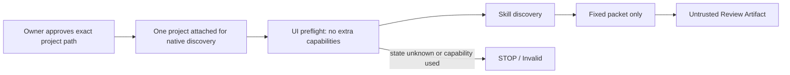

# ADF Claude Code Native Discovery Attachment

> Status: Implemented and Project Owner reviewed
> Related Task: [ADF-CLAUDE-SKILL-002](../tasks/ADF-CLAUDE-SKILL-002.md)

## Purpose

Define the smallest exception that lets Claude Code discover the checked-in `adf-independent-review` Skill without treating the attached ADF repository as review evidence.

## Mode Contract

The mode name is `native-discovery-packet-only`.

| Allowed | Prohibited |
| --- | --- |
| Exactly one Owner-approved project attachment for Skill discovery; fixed synthetic Packet; display-only observation | Using repository content as evidence; Read/Search; terminal, browser, computer-use, diff/write; attachment, Connector/MCP, GitHub integration, command, link traversal, implementation, approval, canonical update |

The exact attachment path is `/Users/kawakamiatsushishi/GitHub/AI-Development-Framework`. No parent directory, Obsidian Vault, second project, file attachment, or integration is permitted.

## State Model

| Folder state | Meaning | Decision |
| --- | --- | --- |
| `none` | No project attached | `packet-only` may run. |
| `native-discovery-only` | Exact approved path attached solely to discover this Skill | This mode may run after preflight. |
| `active` | Project content, search, or a tool is requested or used | `Invalid / STOP`. |
| `unknown` | Attachment/capability state cannot be established | `STOP`. |

## Observability and Limits

The Project Owner records the exact UI path, displayed model/surface, session time, skill/packet hash, whether a visible tool invocation occurred, and any deviation. Claude self-report, Owner UI observation, and `Not verified` are separate fields.

This does not technically prevent file reading or prove that no hidden context, telemetry, or cloud transfer occurred. It is an experiment in behavior, not a security boundary or proof of independence.

## Acceptance Criteria

- The Skill distinguishes `native-discovery-only` from `active` and `unknown`.
- The exact path and all forbidden actions are named.
- Any visible tool invocation, path mismatch, extra attachment, Connector/MCP, GitHub integration, or project-content reference invalidates the run.
- The next forward test is a separate Task and requires a separate execution approval.
