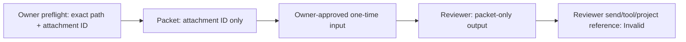

# ADF Claude Reviewer Contract Clarification

> Status: Implemented and Project Owner reviewed
> Related Task: [ADF-CLAUDE-SKILL-003](../tasks/ADF-CLAUDE-SKILL-003.md)

## Purpose

Remove three ambiguities before a native Skill forward test: review-mode display, exact attachment path handling, and the difference between Owner delivery of a synthetic packet and a Reviewer-initiated external send.

## Contract

| Concern | Clarified rule |
| --- | --- |
| Mode | Output may state `packet-only` or `native-discovery-packet-only`. |
| Exact path | The Owner UI preflight records the path. The synthetic packet uses only `ADF-NATIVE-SKILL-ROOT-001`. |
| External send | Owner-approved one-time input is allowed only under a separate execution approval. Reviewer-initiated send/upload/publish/relay is prohibited. |
| Attachment terminology | Folder count and state are separate from file-attachment count. |
| Result vocabulary | `Pass`, `Fail`, `Unclear`, `Invalid`, and `STOP` have distinct meanings in the next forward-test Task. |

## Limits

This clarification does not prove native Skill loading, repository non-reading, hidden-context absence, telemetry absence, or technical isolation. Those remain `Not verified` even if the forward test later passes.

## Verification

- All three affected skill files use the same two review modes.
- Exact path occurs in the Owner preflight reference, not in the packet contract's packet fields.
- Owner delivery and Reviewer-initiated send are distinct.
- No runtime action is performed in this Task.
