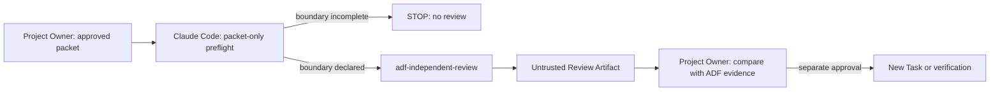

# ADF Claude Code Reviewer Skill

> Status: Implemented and Project Owner reviewed
> Related Task: [ADF-CLAUDE-SKILL-001](../tasks/ADF-CLAUDE-SKILL-001.md)

## Purpose

`adf-independent-review` makes a Claude Code review of an ADF Review Packet repeatable. It fixes the evidence boundary, finding classes, and output structure before a reviewer starts reasoning. It does **not** retrain Claude, establish independence, or technically sandbox Claude Code.

## Scope

| In scope | Out of scope |
| --- | --- |
| Claude Code native skill, packet-only preflight, fixed rubric/template, references, ADF Task and Obsidian rationale | Plugin/ZIP upload, Claude Desktop installation, Folder/Vault/repo access, MCP/connectors, browser/terminal/computer use, external send, API, Adapter, automated review, implementation based on a finding |

## Runtime Contract

The default mode is `packet-only`.

1. The requester supplies a complete fixed packet and declares that no local or external capability may be used.
2. The skill prints the stated surface/model/access metadata and stops if that boundary cannot be established.
3. It classifies each point as `new-supported`, `existing-known-gap`, `insufficient-or-inapplicable`, or `outside-scope`.
4. It returns an untrusted Review Artifact. Only the Project Owner can decide to verify, implement, or update an ADF canonical record.

## Installation and Safety Boundary

The native Claude Code discovery location is `.claude/skills/adf-independent-review/SKILL.md`. The installed location can coexist with Claude Code's local capabilities; the instructions alone cannot remove those capabilities. Therefore packet-only is a behavioral control, not a technical access control.

Do not attach a folder, repository, Vault, file, connector, MCP server, or browser/terminal/computer-use permission to a packet-only review. A technically enforced isolated reviewer or any scoped local review requires a later ADF Adapter/sandbox Task and a separate approval.

## Verification Plan

This Task validates structure only:

- required frontmatter and the three linked references exist;
- the skill states packet-only prohibitions, stop behavior, classifications, and an output template;
- repository Markdown and diff whitespace are valid.

It does not prove that Claude Code follows the skill. A future execution Task may forward-test three synthetic packets: an already-known symlink test gap, an inapplicable renderer-Markdown premise, and an explicit network-policy contradiction.
