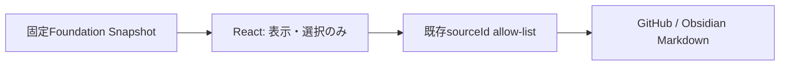

# ADF Control Plane Foundation

> Status: Approved for implementation — 読み取り専用の派生Snapshotのみ。
> Related: [ADF-FOUNDATION-001](../tasks/ADF-FOUNDATION-001.md)

## 境界

この実装はAdapter Registry、Grant、Job、Artifact、Integration Gateを**表示するだけ**である。GitHub Taskは目的・承認・統合判断の正本、Obsidianは背景の正本であり、Snapshotは第三の正本にならない。Grantは`not-issued`または`expired`だけを表示し、権限を付与しない。

## 構成とフロー

`main`と`preload`のIPCは既存の`openCanonicalSource(sourceId)`のみ維持する。network、DB、認証、API、Adapter接続、実行、承認、取消、再試行、書込みは追加しない。

## 表示責務

| 要素 | 表示すること | 行わないこと |
| --- | --- | --- |
| Registry | 接続方式・データ分類・未接続状態 | 登録・認証・接続 |
| Grant | Task、scope hash、能力、期限、失効 | 権限付与・更新 |
| Job | 親子関係、停止理由、Evidence状態 | 起動・停止・再試行 |
| Artifact | input hash、検証、固定Evidenceリンク | ファイル読取・差分実行 |
| Gate | 足りないEvidence、Owner判断待ち | 承認・統合・正本更新 |

## 受入条件

- [ ] `read`/`propose`以外の能力を含むSnapshot Grantを拒否する。
- [ ] Snapshotを実行権限に変換する関数、IPC、UI操作が存在しない。
- [ ] 子Jobが親の能力を超えると拒否する。
- [ ] すべてのデータ分類で外部送信を拒否する。
- [ ] UIは固定sourceIdのMarkdownだけを開き、任意path/URLを受け付けない。
- [ ] typecheck、unit test、production build、手動表示を確認する。
