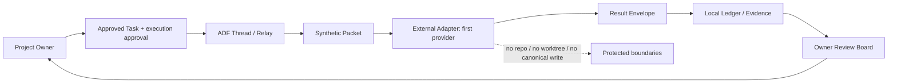

# ADF External Adapter 最小実証設計

> Status: 設計承認済み・実装完了（Electron接続含む）。実送信は未実施（Project Ownerの「外部送信OK」指示待ち）。
> Related task: [ADF-EXTERNAL-ADAPTER-001](../tasks/ADF-EXTERNAL-ADAPTER-001.md)

## 1. 目的

ADFの既存Thread / Relayへ、実AI Adapterを一つ接続し、Project Ownerの承認済みTaskからSynthetic Packetを送信し、構造化ResultをADFへ戻す最小往復を、このPC上で実証する。

Claudeは最初の接続試験対象とする。ただしこれは接続リスクを測る順序であり、ADF製品をClaude専用にする判断ではない。第二Adapter以降は、同じ共通契約、同じResult検証、同じOwnerレビュー境界へ追加する。

## 2. 完成条件

1. ADFの承認済みThreadから、実AIへ一回だけSynthetic Packetを送れる。
2. 実AIの回答を同じThreadのTurn / Result Envelope / Evidenceとして取り込める。
3. 送信範囲、Provider、役割、費用Tier、開始・終了、timeout、停止理由を記録できる。
4. 外部AIの回答を自動採用せず、Ownerレビュー待ちで停止する。
5. repo、Obsidian、worktree、秘密情報、会話全文を送信しない。
6. アプリ終了・回答遅延時は既存Recoveryへ戻り、無限retryや自動再送を行わない。
7. Fake Adapterの77件を含む既存検証が回帰しない。

## 3. システム境界



ADFは送受信・状態・証跡・Owner判断待ちを管理する。AIの推論、プロジェクト固有の分析、コード実行、正本更新は担当しない。

### 3.1 Provider-neutral境界

`ExternalConversationAdapter`はProviderを知らず、`ExternalTransport`の共通契約だけを利用する。Provider固有のHTTP、CLI、認証、応答形式、timeout/cancel処理は各Transportに閉じ込める。新しいProviderを追加しても、Thread、Relay、Recovery、Result Envelope、Ownerレビューの契約は変更しない。

Registryでは`provider`、`adapterId`、`connection`、`authMode`を分離する。`adapterId`はADF内の実体識別子、`provider`はサービス提供者、`connection`は接続方式、`authMode`は認証の受け渡し方式である。

`local-http`は`local-only`であっても自動選択しない。利用時は`adapterId`を明示し、TransportとRegistryの`connection`一致、および`localhost` / `127.0.0.1` / `::1`へのendpoint確認を通す。これは外部URL誤設定を防ぐゲートであり、モデルのtelemetry、cloud fallback、外部検索まで保証するものではない。

`external-send`のAPI/CLIは、従来どおりOwnerの実行承認、認証状態、費用Tier、送信範囲の照合を必須とする。`local-http`の実接続、モデル取得、実AI品質、telemetryは別Taskで検証する。

## 4. In scope

- 接続方式（公式API / CLI等）の実行環境preflightと、採用方式の記録。
- RegistryへProvider、役割、接続方式、`external-send` / `paid-call`、データ方針、費用Tier、停止方法を登録する。
- Task ID、Thread ID、scope hash、context hash、roleを束ねた最小Synthetic Packetを生成する。
- 送信前の実行直前確認と、Ownerが承認した一回の外部送信。
- 既存`send` / `getState` / `receive`契約へのAdapter実装。既存Thread / Recoveryを再利用する。
- Result EnvelopeのTask / Thread / input hash、status、verification、risks、termination reasonの検証。
- 外部送信回数、実行時間、費用Tier、エラー種別、回答有無の最小Ledger記録。
- timeout、cancel、プロセス終了、回答不正時のOwnerレビュー待ち反映。
- 実AIの回答をOwnerが確認し、継続・停止・次Task化を判断できること。

## 5. Out of scope

- repo、Obsidian、Vault全体、branch、worktree、未承認ファイルの送信。
- 外部AIによるTerminal、Browser、MCP、ファイル編集、コード実行。
- 正本の自動変更、commit、push、merge、公開。
- APIキーの生成・保存・Ledger記録。既存の認証環境を使う場合も秘密値はADFへ渡さない。
- 動的Adapter選定、自動Fallback、並列実行、無限討論、自動承認。
- 第二Providerの同時実装。第二Adapterは最初の実測後に別Taskで追加する。

## 6. 処理フロー

```text
Owner-approved Task
  → execution preflight（Provider / connection / packet / budget / data boundary）
  → local-httpならendpoint確認 / external-sendならOwner承認
  → dispatch intent / pending
  → external Adapter send
  → getState / receive
  → Result Envelope validation
  → Thread Turn + Evidence + Ledger
  → Owner Review待ち
```

外部送信、費用超過、追加Context、認証要求、Scope変更、Provider変更が発生した場合は自動継続せず停止する。

## 7. データ契約

Synthetic Packetは、ADFの動作確認に必要なダミーTask目的、固定された役割指示、Result形式、停止条件だけを含む。実プロジェクトのソース、秘密情報、個人情報、Obsidian本文、会話全文は含めない。

Resultは既存Envelopeへ次を追加記録できる最小形とする。

```text
adapterId / provider
role
taskId / threadId / jobId
inputHash / scopeHash / contextHash
status: success | partial | failed | invalid | timeout | cancelled
verification[] / risks[]
durationMs / costTier / terminationReason
ownerDecisionRequired / nextOwnerDecision
```

回答本文は必要最小限だけをTurnへ保存し、APIキー、token、認証情報、不要な個人情報は保存しない。

## 8. 優先度と停止条件

| 優先度 | 対象 | 方針 |
|---|---|---|
| S | 未承認外部送信、秘密情報、課金上限超過、正本変更 | 即停止し、Owner判断待ち |
| A | Task / hash不一致、回答不正、timeout、再起動 | Result拒否または既存Recoveryへ戻す |
| B | Provider固有の形式、遅延、telemetry、費用記録 | 事実を記録し、未検証の安全性を主張しない |
| C | UI高度化、複数Provider、並列化 | 本Task後へ送る |

次の場合は実装を止める。

- 新規依存、実行方式、送信範囲、Provider、費用が設計から変わる。
- repo / Obsidian / worktree / secretsの送信を避けられない。
- 外部AIの回答を自動で正本へ反映する必要が生じる。
- 既存Fake Adapter、Thread、Recovery契約を壊さないと接続できない。

## 9. Owner判断事項

1. 第一接続試験をClaudeで行うこと。
2. 実行方式（API / CLI等）はpreflight後に確定し、未検証の方式を実装前提にしないこと。
3. Synthetic Packetのみを送信対象とすること。
4. 実行直前に外部送信と費用を一回ずつ明示承認すること。
5. 成功してもADF製品を単一Providerへ固定しないこと。
