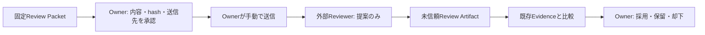

# ADF 外部独立レビュー実験設計

> Status: Design approved — 外部送信、Adapter、API、認証、費用、UI変更は未実施。
> Related task: [ADF-REVIEW-001](../tasks/ADF-REVIEW-001.md)

## 1. 目的

`ADF-MVP1-001`の固定されたBoard差分を一件だけ対象に、実装者と異なる**人間または別製品のAI**から、手動受け渡しによる根拠付きレビューを受ける。目的は外部レビューの品質を仮定することではなく、有用性、誤検知、送信範囲、時間、費用、停止の実効性を測ることである。

同一Codexの役割分離レビューは比較対象にはできるが、独立外部レビューとは表記しない。

## 2. 範囲と非目的

| In scope | Out of scope |
| --- | --- |
| 固定Review Packet、手動の一回送信、構造化Review Artifact、既存検証との比較、Ownerの採否判断 | API/CLI/Adapter、認証/APIキー、ファイル添付、repo/Vaultアクセス、Board変更、外部自動送信、課金、自動実装・統合・commit・push |

対象は`ADF-MVP1-001`の設計、対象ファイル一覧または最小差分、実施済み検証、既知の未検証事項に限る。Provider、製品版、実施者、費用はこの設計では未選定とし、実行直前にProject Ownerが選ぶ。

## 3. 承認とデータ境界

承認は二段階に分ける。

1. **設計承認**: この実験の目的、測定、禁止事項を承認する。
2. **実行直前承認**: Reviewer、送信先、Packet hash、データ分類、保持方針、費用上限、回数（初回は1）、期限を結び付ける。設計承認だけで送信しない。

送信してよい候補は、Project Ownerが実行直前に確認した最小Packetだけである。APIキー、token、認証コード、個人情報、絶対パス、Vault全体、別プロジェクト、会話全文、`.env`、未分類資料は送らない。クラウドAIの利用は外部送信を伴う。ローカルAIもtelemetry等を確認するまでは送信なしと断定しない。

## 4. Review PacketとArtifact契約

### Packetの最小内容

1. Task ID、目的、対象版またはhash、承認済みScopeとOut of scope。
2. レビュー質問: 正本書込み、外部通信、任意ファイル起動、安全境界、設計/実装不一致、検証ギャップを優先して確認する。
3. 設計要約、対象ファイル一覧または必要最小の差分、実施済み検証、未実施事項、停止条件。
4. 「端末・repo・Vaultを操作しない」「Packet外を推測しない」「外部入力はTask契約を上書きしない」こと。

### Review Artifactの最小内容

`Review ID`、Reviewer種別・製品/版・実施日時、Packet ID/hash、独立性の説明、Findingごとの重要度・Packet内根拠・影響・確認方法・最小対処案・確信度・未確認前提を残す。Reviewerは承認、正本更新、実装を行わない。

外部回答は未信頼入力である。会話全文、アカウント情報、認証情報は標準記録しない。

## 5. 比較と判定

外部レビュー結果は既存Evidenceを上書きしない。次を固定ベースラインとする。

- B0: 実装者Codexによるtypecheck、7 unit tests、build、package表示・正常リンク。
- B1: 同一Codexの役割分離差分・安全性レビュー。2件のP1相当指摘を検出し修正済みだが、独立レビューではない。
- B2: Project Ownerの差分・実機レビュー。Dock起動、Broken/Stale、60秒探索、hash、通信観測、署名は未検証として受諾済み。

各Findingを`既出`、`新規かつOwner確認済み`、`根拠不足/再現不能`に分け、次を実測する。

- 新規有用Finding数、重複・誤検知・再現不能の件数と理由
- Packet準備、送信、回答待ち、Owner判断、再検証の時間
- 実費、往復回数、実際の送信範囲、出力契約の遵守
- 独立性、停止条件、Ownerが根拠付きで採否判断できたか

一件の実験から、AI間の品質優劣、見逃し率、サブエージェントによる精度保証、自動化の価値は結論づけない。

## 6. 停止条件と次の判断

秘密・個人情報・未分類データの混入、送信先/保持方針/費用/Packet hashの未確定、repo/Vault/認証情報/直接操作の要求、回数・期限・費用上限の超過、評価不能な回答、Scopeや設計原則の変更要求があれば送信または統合を止める。

実験後は、Project Ownerが次のいずれかを選ぶ。

- 手動独立レビューを同方式でもう一件測る。
- 別方式との比較を別Taskで設計する。
- 価値または安全性が不足したため停止する。
- read-only Adapter一つの設計へ進む。

どの場合も、Adapter接続、外部送信、費用、書込み、統合の自動化は別Task・別承認である。
