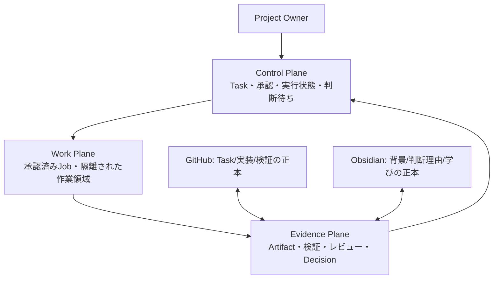
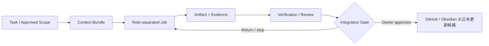

# ADF 複数AI管制エンジン設計

> Status: Design only — 接続、UI、API、DB、ジョブ実行は未実装。
> Related task: [ADF-ORCH-001](../tasks/ADF-ORCH-001.md)

## 1. 目的と非目的

ADFの将来の管制エンジンは、Project Ownerが一つの司令塔から複数AIの**担当、成果物、証跡、承認待ち、統合判断**を見渡すための設計である。統括AIは作業を提案・整理できるが、目的、優先順位、承認、費用、外部送信、公開、統合の最終判断を置き換えない。ADFはProject進捗管理とAI間の受け渡しを担い、PECなど他プロジェクト固有の分析エンジンやAIの推論そのものは担わない。

これは「すべてのAIを自動操作する」設計ではない。初期は、人間が登録したAIと手動で受け渡した成果物を同じTask契約で比較する。各AIの接続可否、品質、料金、データ規約、サブエージェント機能は将来の個別検証対象である。

## 2. 三つの面と正本



| 面 | 責務 | 正本との関係 | 禁止事項 |
| --- | --- | --- | --- |
| Control Plane | Taskの表示、承認待ち、Job状態、リスク、停止・取消、統合候補を提示する | 将来のローカルLedgerは実行状態だけを持つ。意味的なTask・判断の正本はGitHub/Obsidianに戻る | 承認の自動生成、正本の無断上書き、会話履歴だけへの保存 |
| Work Plane | 承認済みContext Bundleをもとに、AIまたは人間が成果物候補を作る | 変更可能な作業は将来もTaskごと・書込領域ごとに隔離する | 正本直書き、権限昇格、未承認の外部送信・課金・push |
| Evidence Plane | Artifact、入力参照、検証、レビュー、リスク、Decisionをつなぐ | GitHubのTask/検証とObsidianの判断理由へリンクする | Evidenceなしの統合、秘密情報・会話全文を必須ログにする |

将来のLocal Ledgerは「どのJobがいつどの状態だったか」を再開するための実行状態であり、第三の意味的正本ではない。Taskの目的・承認・完了根拠はGitHub、背景と長い判断理由はObsidianに残す。

## 3. 最小エンティティ

| エンティティ | 最小内容 | 所有者 |
| --- | --- | --- |
| Task | ID、Objective、Scope、正式Lifecycle、正本リンク | GitHub Task |
| Job | Task ID、役割、Adapter、入力参照、許可能力、状態、停止方法 | Control Plane / 将来のLedger |
| Agent / Adapter | 登録名、接続方式、能力、データ方針、予算・時間上限、出力契約 | Project Ownerが承認するRegistry |
| Artifact | Task ID、作成者、役割、内容または保存先、入力参照、hash/version、検証状態 | Evidence Plane |
| Approval | Task ID、対象Scopeまたはversion/hash、承認者、有効期限、許可能力 | GitHub Taskを正本とする |
| Integration Gate | 統合候補、差分、検証、レビュー、残存リスク、Owner判断 | Evidence PlaneとGitHub Task |

## 4. 権限と承認

すべてのAdapterは初期状態を**deny by default（許可されるまで不可）**とする。承認は自然言語の「進めて」ではなく、少なくともTask ID、対象ScopeまたはArtifact version/hash、承認者、有効期限、許可能力を結び付けて記録する。UIが将来できても、表示状態の遷移だけでこの承認を代替しない。

| 能力 | 初期値 | 追加に必要な承認 |
| --- | --- | --- |
| `read` | Taskで指定したContext Bundleだけ | Task Scope |
| `propose` | 許可 | Task Scope |
| `write-sandbox` | 不可 | 対象作業領域・rollback・検証 |
| `write-canonical` | 不可 | 正本ファイル、差分、レビュー |
| `external-send` | 不可 | 送信先、データ分類、保持方針 |
| `paid-call` | 不可 | 予算上限、課金主体、停止条件 |
| `push` / `merge` | 不可 | 対象branch、差分、検証、Project Ownerの明示判断 |

統括AIは、Taskを分解しJobを提案しても、Project Ownerを代行して承認・統合しない。アプリを閉じた時は新規Jobの自動開始を行わず、次に必要な判断と停止状態を正本へ記録してから再開する設計を基本とする。

## 5. 成果物と統合ゲート

複数AIの成果物は、回答本文だけでなく、どのTask・文脈・権限から生じたかを追跡できるArtifactとして扱う。共通の最小項目は[Adapter契約](ADF_AGENT_ADAPTER_CONTRACT.md)で定める。



統合する前に、次を一件ずつ満たす。

1. Task IDと承認済みScopeに対応する。
2. 変更範囲またはArtifact version/hashを比較できる。
3. 定義済みVerificationのPass / Fail / Not runと根拠がある。
4. 実装者と異なるReview担当、または独立性が不足する理由と代替確認がある。
5. Required Context、入力参照、残存リスク、停止条件がある。
6. Project Ownerが統合・正本反映を明示承認する。

一つでも欠ける場合、統合ではなく`Paused`、`Changes requested`、または新しいTask候補として扱う。

## 6. サブエージェント境界

各AIが内部のサブエージェントを使えること自体は将来の候補だが、精度を保証する仕組みではない。初期の設計上限は、**統括AI → 担当AI → 検証子**の二段までとする。孫以降の再委任は不可である。

| 項目 | 初期契約 |
| --- | --- |
| 親子関係 | 子の能力は親の許可能力を超えない |
| 書き込み | 子は原則`propose`のみ。書込みは別承認された作業領域へ限定 |
| 外部送信・課金 | 子には付与しない |
| 回数・時間 | Jobごとの上限をRegistryと承認に記録する |
| 停止 | 親の停止、Ownerの取消、時間・費用上限、失敗で直ちに停止可能にする |
| 証跡 | 親Job、子の役割、入力参照、出力Artifactを追跡できるようにする |

## 7. 司令塔の将来UI設計

以下は画面契約であり、画面実装ではない。

```text
┌ Project switcher ───────────── Approval / risk queue ─────────────┐
│ Project | Task filter          Owner decision needed / expiry      │
├ Task board ───────────────────────────────────────────────────────┤
│ Context・Plan | 承認待ち | Work | Verify/Review | 完了 / Blocked  │
├ Focus pane ──────────────── Evidence / comparison ─────────────────┤
│ Task / Scope / stop condition  Artifact diff / Context / risk      │
├ Later: Agent Registry ────── Later: Execution Ledger ──────────────┤
│ adapter authority / budget     Job state / retry / cancel           │
└───────────────────────────────────────────────────────────────────┘
```

画面遷移は、`Dashboard → Task Detail → Approval Queue → Artifact Compare → Integration Gate → Decision Record`を想定する。ただし、画面遷移やCard移動は承認を発生させず、Ownerの明示操作と正本記録が必要である。

## 8. 段階導入

| 段階 | 扱うこと | 開始条件 |
| --- | --- | --- |
| 0: 設計契約（今回） | 管制面、Adapter、Artifact、統合、承認の契約 | Project Ownerの設計レビュー |
| 1: Product MVP 1 | 手動・読み取り専用Board、正本リンク、手動Artifact比較 | Board実装設計の承認 |
| 2: 外部レビュー実験 | Board差分を対象に、別AIまたは人間の独立レビューを1件測る | 共有範囲・評価・費用・データ方針の別承認 |
| 3: 読み取りAdapter | 低リスクな一つのAdapterをread-onlyで試す | 接続方式・秘密情報・停止・ログ設計の承認 |
| 4: 隔離書込み候補 | Task単位の作業領域で候補変更を作る | worktree、差分、rollback、統合ゲートの実証 |
| 5: 複数Adapter管制 | 複数の役割分離Jobを比較・統合する | 前段の実測が価値・安全性・費用を支持する |

## 9. 削除できない中核

ADFの差別化は、AIの数や自動化の派手さではない。**人間の承認と、正本へ戻れる根拠つきEvidenceを、委任・比較・統合の全工程で残すこと**である。統括AIや新規AIが増えても、この中核を省略する機能は導入しない。

## 10. 未解決事項

- Codex、Claude Code、Gemini、Z.ai、Qwen、DeepSeek、Perplexity、Ollama、NotebookLM、GitHub、Obsidianそれぞれの実接続可否・規約・費用・データ送信範囲。
- 実行Ledgerの保存場所、保持期間、バックアップ、復旧、会話ログの最小化。
- 実際のBoardでOwnerが判断を見つけるまでの時間、誤判定、記録負担。
- 外部AIの独立性、誤検知、見逃し、サブエージェントによる品質向上の実測。

これらは推測で解決せず、Boardの差分と個別Adapterを対象にした後続Taskで測定・承認する。
