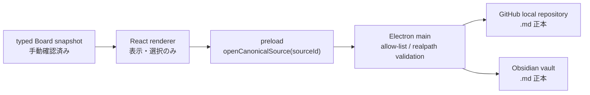

# ADF Product MVP 1 — ローカル読み取り専用Task Board実装設計

> Status: Approved for implementation
> Related task: [ADF-MVP1-001](../tasks/ADF-MVP1-001.md)

## 1. 境界

初回はADF単一プロジェクトを対象に、3〜5件の**手動確認済み表示スナップショット**だけを表示する。これは実験範囲であり、将来の複数プロジェクト司令塔を否定しない。GitHubはTask・承認・検証、Obsidianは背景・判断理由の正本で、Boardは派生した判断画面である。

Electron + React + TypeScriptをローカルで動かす。VS Codeは、承認済みScopeの編集、debug、diff、local previewに使える作業面であり、正本・承認者・Adapterではない。

## 2. 構成



| 層 | 責務 | 禁止 |
| --- | --- | --- |
| Snapshot | 表示に必要な派生データ | 正本更新、自動生成、自動同期 |
| Renderer | Card、Queue、Focus panel、状態表示 | Node/Electron直接利用、任意URL/path、編集 |
| Preload | `sourceId`をmainへ渡す唯一のAPI | 任意IPC、filesystem/shell公開 |
| Main | 静的allow-listを検証後、正本Markdownを開く | renderer入力をURL/pathとして実行、ネットワーク |

`contextIsolation: true`、`nodeIntegration: false`、`sandbox: true`、`webSecurity: true`を維持する。navigation、new window、permission requestを拒否し、CSPは`connect-src 'none'`を含める。

## 3. UIと状態

```text
┌ ADF ─ Last confirmed ───────────── Owner decision / Risk queue ┐
├ Context・Plan │ 承認待ち │ 検証・レビュー │ 完了 │ Blocked ┤
├ Focus: Task / decision / risk / next action / source links ────┤
└ Evidence / freshness: Current | Stale | Broken | Unconfirmed ──┘
```

Card選択はFocus panelの表示だけを変える。Board laneは正式Lifecycleを置き換えない。編集、drag/drop、状態遷移、承認、同期、削除、検索、複数プロジェクト切替は実装しない。

## 4. Link Policy

- Cardは任意URL/pathではなく許可済み`sourceId`だけを持つ。
- main processが静的Registryから相対pathを得て、`realpath`後もrepoまたはVault root内であること、存在する通常`.md`であることを確認する。
- `..`、絶対path、`file:`、`https:`、`javascript:`、root外、symlink escape、非`.md`、不存在は開かず`Broken`として返す。
- `shell.openPath`は検証済みのローカルMarkdownだけに使う。GitHub WebやObsidian URI、任意外部URLはMVP外である。

## 5. 検証

- typecheck、unit test、production buildを実行する。
- 承認待ち、Blocked、検証・レビューの3代表Cardで、Ownerが判断・Blocker・次の安全な一手・正本を60秒以内に見つけられるかを実機で確認する。
- 未知sourceId、空値、path injection、root外、symlink、非`.md`、不存在を拒否し、openを呼ばないことをtestする。
- 起動・閲覧・リンク操作の前後で、repo/Vaultに書込みがないこと、アプリがAPI/認証/DB/telemetry/ネットワークを使わないことを確認する。
- Dock起動はpackaged appで別途手動確認する。署名・notarization・配布は対象外。
