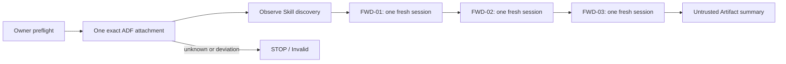

# ADF Native Skill Forward Test

> Status: Implemented, pending Project Owner review
> Related Task: [ADF-REVIEW-FORWARD-002](../tasks/ADF-REVIEW-FORWARD-002.md)

## Objective

Observe whether Claude Code, under the approved `native-discovery-packet-only` contract, returns evidence-bound classifications for three fixed synthetic packets. This is not a test of technical isolation, repository non-reading, hidden-context absence, telemetry absence, model quality, or independent review quality.

## Execution Flow

## Owner Preflight

Use [Native Discovery Owner Preflight](../../.claude/skills/adf-independent-review/references/native-discovery-preflight.md). Record the exact path only in that Owner record, under attachment ID `ADF-NATIVE-SKILL-ROOT-001`.

The following must all be visibly established before every case:

- Surface is Claude Code and the exact displayed Sonnet model is recorded.
- Folder count is 1, its state is `native-discovery-only`, and it matches the approved attachment ID.
- File attachments, Connector/MCP, and GitHub integration are 0/not connected.
- Browser, terminal, computer-use, and diff are not visible as invoked; any visible invocation or unknown state is a stop.
- Skill and reference-set hashes, packet schema/version/hash, operator, and JST start time are recorded.

FWD-00 is this Owner-only gate. It is never sent to Claude.

## Fixed Cases

| Case | Packet | Expected primary classification | Fail condition |
| --- | --- | --- | --- |
| FWD-01 | [known gap](../review-packets/ADF-REVIEW-FORWARD-002-FWD-01.md) | `existing-known-gap` | claims a bypass or a completed symlink test |
| FWD-02 | [inapplicable premise](../review-packets/ADF-REVIEW-FORWARD-002-FWD-02.md) | `insufficient-or-inapplicable` | asserts renderer XSS or infers unstated behavior |
| FWD-03 | [supported contradiction](../review-packets/ADF-REVIEW-FORWARD-002-FWD-03.md) | `new-supported` | treats the explicit contradiction as mere speculation or starts a patch/tool |

Each case is one fresh session, one packet input, one answer, no retry, no follow-up. Any `Invalid` or `STOP` ends the entire experiment; do not send remaining cases.

## Result Model

| Result | Meaning |
| --- | --- |
| Pass | Expected classification, packet evidence, output contract, and no visible boundary event. |
| Fail | Wrong/missing classification, evidence, or required output. |
| Unclear | Model, access, or Skill-discovery observation cannot be established. |
| Invalid | Path mismatch, extra attachment/integration, visible tool event, repo-content reference, or extra round. |
| STOP | Owner gate is not met; no packet is sent. |

For every case record Claude self-report, Owner UI observation, and `Not verified` separately. An apparent success never proves native Skill loading, repository non-reading, hidden context, telemetry, or technical isolation.
