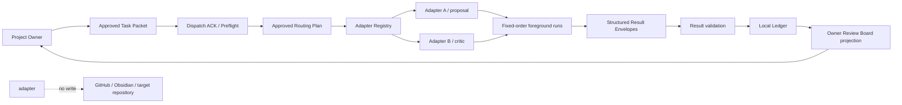

# Task — ADF-CLAUDE-ADAPTER-001: 複数AI対応Adapter基盤と最初の実Adapter検証

> Type: Implementation
> Status: Done
> Owner: Codex
> Review AI: Project Owner（最終Review）
> Related Tasks: [ADF-JOB-LOOP-001](./ADF-JOB-LOOP-001.md) / [ADF-DISPATCH-ACK-001](./ADF-DISPATCH-ACK-001.md)

このTaskは `docs/workflow/TASK_LIFECYCLE.md` と `docs/workflow/AI_DELEGATION_CHARTER.md` に従う。複数AIを製品の前提とし、Claude Codeは最初の実Adapter検証対象として扱う。Claude Codeへの外部送信・CLI実行・認証・課金は別承認・別Taskとする。

## 1. Objective

- なぜ今このTaskが必要か: Fake AdapterでTask受付からOwner Review待ちまでのローカル搬送路を確認できたため、次に複数AIを費用・得意分野・役割で振り分ける共通境界を固定する必要がある。
- 達成したい結果: Adapter RegistryとOwner承認済みRouting planで複数AIを役割別に選択し、Fake A/Bを独立Adapterとして構造化Resultへ戻す。Claude Codeは後続の最初の実接続例とする。
- 対象ユーザー: Project Owner。Task、Context、権限、Claude CodeのResult、次の判断を確認する。

## 2. Success Criteria

設計承認後の実装・実行Taskでは、次を検証可能にする。

1. Task ID、Scope hash、Context hash、Adapter ID、Job IDを送受信で追跡できる。
2. `ADF-DISPATCH-ACK-001`のACKが有効な場合だけ、Owner承認済みRouting planのAdapter実行へ進む。
3. 役割ごとのAdapter選択、capability、費用Tier、データ送信条件をRegistryから追跡できる。
4. 1 Job内の複数Adapter実行は、まず固定順序のforeground実行とし、無制限retry・常駐再開をしない。
5. 入力は明示的に承認された最小Packetだけで、秘密情報・会話全文・Vault全体を送らない。
6. Resultを固定契約で検証し、`success / partial / failed / invalid / timeout / cancelled`を区別する。
7. 異常終了、timeout、キャンセル、Task ID不一致、Result形式不正をOwner判断待ちへ戻せる。
8. GitHub／Obsidian正本、対象Repository、worktreeを自動変更せず、commit／push／merge／統合を行わない。
9. Result hash、input hash、実行時間、終了理由、未実施、残存リスク、費用TierをLedgerへ記録できる。

## 3. Required Context

### GitHub

- [Current State](../project/CURRENT_STATE.md)
- [Goal](../project/GOAL.md)
- [MVP](../project/MVP.md)
- [Roadmap](../project/ROADMAP.md)
- [ADF Agent Adapter Contract](../design/ADF_AGENT_ADAPTER_CONTRACT.md)
- [ADF Multi-AI Control Plane](../design/ADF_MULTI_AI_CONTROL_PLANE.md)
- [ADF-JOB-LOOP-001](./ADF-JOB-LOOP-001.md)
- [ADF-DISPATCH-ACK-001](./ADF-DISPATCH-ACK-001.md)
- [Claude Reviewer Skill設計](../design/ADF_CLAUDE_REVIEWER_SKILL.md)
- 開始時点のbranch: `codex/adf-pilot-governance`
- 既存の未コミット・未追跡差分は対象外として保持する。

### Obsidian

| ノート | 採用する制約・判断 |
|---|---|
| `Projects/AI-Development-Framework/16_ChatGPT_ADF_各AI自動往復構想_2026-08-07.md` | Fake Adapterの次に複数AI対応の共通Adapter基盤を検証する。Claude Codeは最初の実接続例であり、製品境界ではない。Result回収と正本採用を分離する。 |
| `Projects/AI-Development-Framework/06_複数AI管制エンジン設計_2026-08-04.md` | Adapterはdeny by default。接続方式、送信範囲、費用、停止、出力契約を個別に確認する。 |
| `Projects/AI-Development-Framework/09_Control_Plane_Foundation実装_2026-08-04.md` | Foundation表示と実行・権限付与・外部接続を混同しない。 |

## 4. Proposed Architecture



### Responsibilities

| System | 責務 | してはいけないこと |
|---|---|---|
| Control Plane / JobRuntime | Task、承認、ACK、Job状態、停止理由、Evidenceリンクを管理する | 承認の自動生成、正本の上書き |
| Adapter Registry / Router | Adapterの役割、能力、費用Tier、データ方針を記録し、承認済み固定Planを選択する | 無承認の動的モデル選定、費用超過 |
| 各Adapter | PacketをAdapter入力へ変換し、割り当てられた役割を実行し、Resultを返す | Scope拡大、正本書込み、push／merge |
| Claude Code Skill | packet-only等の行動契約を提示する | 技術的sandboxや送信なしを保証すること |
| Result Validator | 必須項目、Task ID、hash、状態、禁止出力を検証する | 不正Resultの採用 |
| Local Ledger | 実行状態、hash、終了理由、Result参照を保存する | 第三の意味的正本になること |
| Board | 派生したOwner Review待ち状態を表示する | Card操作で承認を発生させること |
| GitHub / Obsidian | GitHubはTask・実装・検証、Obsidianは背景・判断理由・学びを保持する | Adapterからの自動更新 |

## 5. Processing Flow

```text
Approved Task
  → Dispatch Packet生成
  → ACK完全照合
  → Adapter Registryと固定Routing planを照合
  → Adapterごとのpreflight（Task / scope / capability / cost / data boundary）
  → 複数Adapterの固定順序foreground実行
  → Adapterごとの限定Result受信
  → Result schema / hash / Task ID検証
  → result.recorded または failed / timeout / cancelled
  → Owner Review待ちBoardへ派生表示
  → Ownerが採用・差し戻し・停止を判断
```

実行中にScope変更、追加送信、認証要求、費用発生、write-sandbox、外部Repository操作が必要になった場合は、自動継続せず`Waiting Approval`または`Blocked`へ戻す。

## 6. Minimum Result Envelope

```text
resultId
jobId
taskId
adapterId
inputHash
scopeHash
contextHash
status: success | partial | failed | invalid | timeout | cancelled
summary
artifact
verification[]
risks[]
ownerDecisionRequired
nextOwnerDecision
createdAt
durationMs
terminationReason
```

会話全文、API key、token、認証コード、不要な個人情報はResult・Ledger・GitHub・Obsidianへ保存しない。

## 7. MVP Scope

### In scope for the next implementation design

- Adapter ID、役割、capability、費用Tier、data policy、接続方式を持つ共通Registry。
- Owner承認済みの固定Routing planと、役割ごとのAdapter選択。
- Fake A／Fake Bを独立Adapterとして扱う入力変換、Result検証、timeout／cancel／invalidのテスト。
- `Dispatch ACK → Routing plan → Adapter preflight → fixed-order runs → Result validation`の状態・イベント設計。
- 実Claude接続試験を別Taskで行うための実行直前承認ゲート。Claudeは最初の実Adapter例であり、単一AIの製品境界にはしない。
- Adapter Registryに必要な接続方式、能力、送信範囲、停止方法、出力契約の記録項目。

### Explicitly out of scope

- Claude Code CLI／SDKの実接続、外部送信、認証、課金。
- Claude CodeのSkillだけによる技術的隔離の保証。
- worktree作成、sandbox書込み、対象Repositoryの変更。
- GitHub操作、PR作成、commit、push、merge、正本統合。
- MCP、Connector、Browser、Terminal、Computer Use。
- 動的モデル選定、自動Fallback、並列Job、無制限のAI討論。
- 常駐Worker、バックグラウンド再開、無制限retry、自動承認。

## 8. UI / State Boundary

このTaskでは新しいUIを実装しない。既存Boardの派生表示に、将来次の情報を追加できる契約だけを設計する。

```text
Task Detail
  ├─ Adapter Plan: proposal → Fake A / critic → Fake B
  ├─ Dispatch: acknowledged / preflight-valid
  ├─ Run: queued / running / failed / timeout / cancelled
  ├─ Result: success / partial / invalid
  ├─ Evidence: input hash / result hash / termination reason
  └─ Owner decision: adopt / return / stop
```

## 9. Failure Conditions and Measurements

| 区分 | 失敗条件・計測 |
|---|---|
| 配送 | ACK欠落、Task／hash／capability／target不一致、実行前送信回数 |
| 実行 | CLI未検出、起動失敗、exit code、timeout、cancel、実行時間 |
| データ | 送信Packetの項目数・分類、秘密情報検出、許可外Context参照 |
| Result | 必須項目充足率、Task／hash不一致、JSON形式不正、status別件数 |
| 安全 | 外部repository変更、正本変更、commit／push／merge、Scope外操作の件数 |
| 運用 | retry回数、Owner判断待ち時間、Result回収時間、手動コピー回数、Adapter別費用Tier |
| ルーティング | 役割適合率、低費用Adapter選択率、Adapter別品質・時間・手戻り |

## 10. Risks and Priorities

| 優先度 | 対象 | 方針 |
|---|---|---|
| S | 外部送信、秘密情報、無承認実行、正本変更 | 実接続前の別承認とdeny by default。検出時は即停止。 |
| A | ACK／Resultの取り違え、timeout、異常終了、無限retry | 固定hash、foreground、retry上限、構造化失敗Result。 |
| B | CLI版差、Skill適用差、ログ形式差、再起動復旧 | Adapter契約とFake transportで先に検証し、未検証を明記する。 |
| C | 並列化、動的選定、UI高度化 | 固定Routing planの実測後まで作らない。 |

## 11. What We Will Not Build Yet

ADFを軽く保つため、次は作らない。

- DB、クラウドサーバー、メッセージブローカー。
- 動的なAI選定・自動Fallbackを行うルーター。
- AI同士の無制限な討論や自動統合。
- Skillをsandboxの代替とする仕組み。
- 実行成功だけでTaskをDoneにする自動化。

## 12. Implementation Decision

Project Ownerの2026-08-10の指示により、単一Claude構成ではなく、複数AIを前提にした共通Adapter基盤へ修正して実装する。Fake A/Bは複数Adapterの最小検証として扱い、Claude Codeの実接続・外部送信・認証・課金は別承認・別Taskとする。

## 13. Approval / Implementation Gate

- Approval required?: Yes
- 承認対象: 本Taskの修正版Scope、複数AI共通Registry、固定Routing plan、Fake A/B、構造化Result基盤。
- 承認記録: Project Ownerが2026-08-10に実装と正本書込みを指示。
- 現在の状態: `Verifying`
- 実Claude Codeへの接続・外部送信は、さらに別の実行直前承認を必要とする。

## 14. Implementation Log

| 日時 | 実施者 | 変更 | 逸脱・追加判断 |
|---|---|---|---|
| 2026-08-10 | Codex | 単一Claude構成の記述を複数AI共通Adapter基盤へ修正 | Claude Codeは最初の実Adapter試験であり、製品境界ではない |
| 2026-08-10 | Codex | Adapter Registry、固定Routing plan、Fake A/Bの独立Result記録を実装 | 外部Claude接続、認証、外部送信は未実施 |

## 15. Verification

| 種別 | 実施内容 | 結果 | 実施者 | 未実施なら理由 |
|---|---|---|---|---|
| 自動 | TypeScript node/web typecheck | Pass | Codex | |
| 自動 | Vitest（既存を含む28 tests） | Pass | Codex | |
| 自動 | electron-vite build / electron-builder arm64 package | Pass | Codex | Developer ID signingは未実施 |
| 静的 | `git diff --check`、jobLoop範囲の外部通信・child process参照なし | Pass | Codex | |
| 自動 | Fake A／Fake Bを役割別に固定Routingし、各Result envelopeを検証 | Pass | Codex | |
| 自動 | 承認済みRouting plan hashの改変を拒否 | Pass | Codex | |
| 手動 | Claude Code実接続、外部送信、認証、費用、実worktree | Not run | Codex | CLI未検出。別Task・別実行承認が必要 |

- 受入条件の照合:
  - [x] 複数AIを製品の前提とし、Claude Codeを製品境界に固定していない。
  - [x] Adapter Registryに役割、capability、費用Tier、data policy、接続方式、状態を記録する。
  - [x] Owner承認済みRouting planをhashでApprovalに結び付ける。
  - [x] Fake A／Fake Bを独立AdapterとしてResult hash、input hash、role、termination reason付きで記録する。
  - [x] Result envelopeのTask／Job／input hash、status、verification、risk、Owner判断を検証する。
  - [x] 外部Claude接続、外部送信、認証、課金、worktree、正本変更、commit、push、mergeを行わない。
- 実装ファイル: `src/shared/jobLoopTypes.ts`、`src/main/jobLoop/adapterRegistry.ts`、`src/main/jobLoop/resultEnvelope.ts`、`src/main/jobLoop/contracts.ts`、`src/main/jobLoop/dispatchAck.ts`、`src/main/jobLoop/runtime.ts`、`tests/adapterRegistry.test.ts`、`tests/jobLoop.test.ts`
- Ledger追加: `adapter-plan.json`、`adapter-results.json`。既存の`dispatch-packet.json`、`dispatch-ack.json`、`result.json`と合わせ、AIごとの役割とResultを追跡する。
- 残るリスク・未検証事項: 実Claude／Gemini／Codex等の接続互換性、外部送信・費用・telemetry、動的選定、並列Job、worktree、実機でのBoard表示は未検証。

## 15.1 Project Owner Review（2026-08-12）

| 対象 | 決定 | 根拠・確認内容 | 日時 |
|---|---|---|---|
| Plan / Scope | Approved | Project Ownerが2026-08-10に複数AI前提の共通Adapter基盤への修正を指示 | 2026-08-10 |
| Diff / Verification | Approved / Done | Adapter Registry・Routing plan生成・hash検証・Result Envelope検証は現行アプリでLive。詳細は下記個別レビュー記録を参照 | 2026-08-12 |

### 個別レビュー記録

- **対象**: `ADF-CLAUDE-ADAPTER-001`
- **判定**: Approved / Done
- **Live範囲**: Adapter Registry（`adapterProfiles` / `getAdapterProfile`）、Routing plan生成・hash検証（`routeAdapters` / `validateAdapterPlan`）、Routing planの永続化（`adapter-plan.json`）、Result Envelope検証（`validateResultEnvelope`）。いずれも`registerApprovedJob`または`relay.ts`のTurn処理を通じて、現行アプリの実Thread開始・実Turn作成のたびに実行される。実runtimeの実Job2件双方で`adapter-plan.json`の実在を確認し、`resultEnvelope.ts`の検証が`relay.ts`の複数箇所から呼ばれていることをソースで確認した。
- **Legacy範囲**: 旧`adapter-results.json`書込み、旧`buildResult`、`runApprovedTask`経由の独立Result記録。`ADF-JOB-LOOP-001`と同じ理由で、現行Electronアプリのどこからも参照されず到達不能。実Jobディレクトリに`adapter-results.json`は存在しない（確認済み）。
- **Doneの意味に含めないこと**: 実Claude接続、APIキー、外部送信、MCP、実AI品質検証は未実施である。本Doneはこれらを検証済みとするものではない。
- **残存リスク**: 実Claude／Gemini／Codex等の接続互換性・費用・telemetryは未検証。動的選定、並列Job、worktreeは未検証。Adapter Registry自体のBoard表示は静的Snapshotのまま（`ADF-BOARD-PROJECTION-001`の対象外）。

## 16. Product Boundary

ADFの責務は、Projectの進捗管理とAI間の安全な受け渡しに限定する。

### ADFが持つ責務

- Project、Task、Job、Adapter、Result、Evidence、Owner判断の状態管理。
- 承認済みTaskの範囲・権限・Routing planの照合。
- AI Adapter間のPacket配送、Result回収、失敗・停止の記録。
- Project Ownerが次の判断を見つけるためのBoard Projection。

### ADFが持たない責務

- PECなど他プロジェクト固有の分析・予測・ドメインロジック。
- AIそのものの知識・推論・品質を代替する機能。
- すべてのAIを無制限に操作する万能実行エンジン。
- 無承認の自動選定、外部送信、課金、正本変更、commit、push、merge。
- 会話全文や秘密情報を蓄積するMemory基盤。

新しい機能は、Project進捗管理またはAI間の受け渡しに直接必要かを確認し、該当しなければ追加しない。
- 実Claude Codeへの接続・外部送信は、さらに別の実行直前承認を必要とする。
