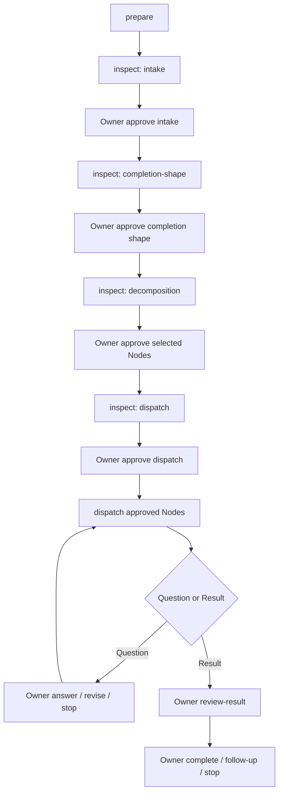

# Task — ADF-FRONTDOOR-CLI-OWNER-LOOP-001: CLI Owner Loop Entrance

> Type: Design + Implementation
> Status: Done
> Owner: Codex
> Review: Project Owner + role-separated review
> Related: [ADF-FRONTDOOR-OWNER-GATE-001](ADF-FRONTDOOR-OWNER-GATE-001.md) / [ADF-FRONTDOOR-LEDGER-EVENT-SOURCING-001](ADF-FRONTDOOR-LEDGER-EVENT-SOURCING-001.md) / [Goal](../project/GOAL.md) / [Current State](../project/CURRENT_STATE.md)

## 1. Objective

実装済みのFrontdoor Owner Gateを、Project Ownerが実際に一段ずつ操作できる最小CLI入口として提供する。CLIはProposalを表示し、Ownerの明示DecisionをEvent Ledgerへ記録し、承認済みNodeだけをFrontdoor Serviceへ渡す。

Electron UIやMCP入口より先にCLIで制御ループを実証する。CLIは薄い入口に限定し、Gate判定、hash検証、状態遷移、Result／Evidence処理を独自実装しない。

## 2. Background and rationale

`ADF-FRONTDOOR-OWNER-GATE-001`で共通Gate契約と拒否経路は完成したが、現状はプログラム呼出しからしかOwner Decisionを操作できない。最終目標の「窓口AI → ADF → 得意分野ごとの複数AI → ADF → 窓口AI」を進めるには、Ownerが各判断点を見て選べる入口が必要である。

CLIを先行する理由は、画面実装の状態管理を追加せず、同じFrontdoor ServiceとEvent Ledgerを使うかを直接検証できるためである。CLIで証明した後にElectron UIを接続する。

## 3. Scope

### In scope

- `src/cli/frontdoorOwnerLoop.ts`等の薄いCLI入口。
- 既存`FrontdoorOrchestrator`／`FrontdoorOwnerGateService`の呼出し。
- `prepare`、`inspect`、`approve`、`dispatch`、`answer`、`review-result`、`complete`、`stop`、`recover`の明示サブコマンド。
- Request／Plan／Child Packetを読み取り、Runtime LedgerへRun／Decision／Evidenceを保存する処理。
- Ownerが各Gateで確認できるJSONまたは読みやすいテキストのProposal表示。
- Gate、Run、Plan hash、Node hash、Result／Aggregate hash、次のOwner actionの表示。
- CLI引数、入力ファイル、権限不足、stale hash、未承認、別Run参照のfail-closed処理。
- CLI unit／integration／negative tests、既存Frontdoorと全体回帰。
- CLI Task正本、CURRENT_STATE、Obsidianマイルストーンの更新。

### Command contract

| Command | Effect | Owner decision |
|---|---|---|
| `prepare` | Request／PlanからRun Proposalを作る | なし。Decisionを作らない |
| `inspect` | 現在Gate、hash、Evidence、次の判断を表示 | なし。読み取り専用 |
| `approve --gate intake --decision proceed --approved-by ...` | Intakeを承認 | `proceed`のみ。未対応の`edit`／`reject`は無視せず非ゼロ終了 |
| `approve --gate completion-shape --decision approve --approved-by ...` | 完成形を承認 | `approve`のみ。未対応Decisionは非ゼロ終了 |
| `approve --gate decomposition --decision approve-selected --approved-by ...` | Plan／Node候補を承認 | `approve-selected`のみ。未対応Decisionは非ゼロ終了 |
| `approve --gate dispatch --decision dispatch --nodes ... --approved-by ...` | 対象Nodeを明示承認 | `dispatch`のみ。空／重複Nodeは拒否 |
| `dispatch` | 承認済みNodeだけを実行 | 直前のDispatch Decision必須 |
| `answer --approved-by ...` | 現在のQuestionへOwner回答を記録し、次のDispatch Gateへ戻す | `answer`。自動Dispatchはしない |
| `review-result --decision ... --approved-by ...` | Aggregate／Evidenceをレビュー | `accept` / `follow-up` / `reject` |
| `complete --approved-by ...` | RunのResult／Evidenceを受入 | `complete`必須。正本統合はしない |
| `stop --approved-by ...` / `recover` | Owner停止／Recovery状態確認 | Stop DecisionをLedgerへ記録し、自動Retryしない |

`execute-all`、`approve-and-dispatch`、自然言語だけでの承認、Rendererからの承認ファイル作成は実装しない。

## 4. Input and output boundary

### Inputs

- Ownerが用意したRequest／Plan JSONまたは既存Frontdoor fixture。
- Ownerが明示したRuntime root。
- Dispatch時にOwnerが指定したChild Packetの読み取り専用ファイル群。
- `--approved-by`、Decision note、Question answer reference等の明示値。

### Outputs

- Runtime root配下のFrontdoor Run、Event Ledger、Snapshot、Aggregate、Evidence links。
- `inspect`のProposal／状態表示。
- エラー時の非ゼロ終了コードと、再実行可能なfail-closed理由。

GitHub／Obsidian正本、repo/worktree、Task本文、approved Task PacketをCLIが自動変更しない。CLIはRuntime Evidenceを生成するだけで、canonical integration、commit、push、次Task実行を行わない。

## 5. Flow

Question回答後はRunを明示的なDispatch承認待ちへ戻すが、自動再Dispatchは行わない。Ownerは`inspect`で次のGateを確認してから再承認する。`complete`はRunのResult／Evidence受入のみを意味する。

## 6. Acceptance Criteria

- [x] CLIの`--help`、unknown command、missing argumentが明確な非ゼロ終了になる。
- [x] `prepare`はRun Proposalだけを作り、Owner Decision、Dispatch、AI送信を発生させない。
- [x] `inspect`はServiceの読み取り専用Projectionから現在Gate、Request／Plan／Node hash、Aggregate hash、Evidence、次のOwner actionを表示する。
- [x] Intake／Completion Shape／Decomposition／Dispatchの承認を個別に記録できる。
- [x] Dispatchは前段Gateと対象Nodeのtarget hashが一致しない限り実行されない。
- [x] `dispatch`は既存Frontdoor Serviceを一度だけ呼び、CLI独自のAdapter選定や`execute-all`を持たない。
- [x] Questionへの回答は現在Runのopen Questionと一致し、answer contentなしでは記録されず、次のDispatch承認待ちへ戻る。
- [x] Result／Evidenceのレビューと`complete`を別コマンドにし、レビューなしCompletionを拒否する。
- [x] 別Run、別Task、別Plan、別Aggregate、改ざんLedgerを拒否する。
- [x] stop／recover後に自動Retry、自動Answer、自動Integrationを行わない。Stop DecisionはLedgerへ記録する。
- [x] 実Provider送信、認証、APIキー、課金、repo/worktree書込み、GitHub／Obsidian正本変更を行わない。
- [x] 既存301件以上のテスト、node/web/cli typecheck、Electron build、diff checkがPassする。
- [x] コンパイル済みCLIで`prepare→inspect`、テストRuntimeでFake Adapterの`prepare→inspect→承認→dispatch→review→complete`を確認した。

## 7. Verification and stop conditions

### Required verification

- CLI pure argument／output tests。
- Temporary Runtime rootを使った一周E2E。
- 承認なしDispatch、前段Gate欠落、stale hash、別Run Question／Aggregate、Result reviewなしCompletion、二重Dispatch、Recovery後Retryのnegative tests。
- CLIと直接Service呼出しで生成されるEvent Ledger／Run／Aggregateの一致確認。
- 実Provider・認証なしのFake Adapter実機操作。
- `tsc --noEmit -p tsconfig.node.json`、`tsc --noEmit -p tsconfig.web.json`、`tsc -p tsconfig.cli.json`、Vitest、`electron-vite build`、`git diff --check`。

### Stop conditions

- 同じ原因による検証失敗が2回連続、または異なる原因でも3回続いたら停止してProject Ownerへ確認する。
- 新規依存、外部送信、認証、課金、Work Plane書込み、正本自動変更が必要になったら停止する。
- CLIが複数Gateを一つの操作へまとめる必要になったら停止し、設計を見直す。

## 8. Out of scope

- Electron IPC／Preload／Renderer UI。
- MCP／HTTP API／常駐Server。
- Ollama／Anthropic／Claude Code CLIの実送信、認証、品質評価。
- Dynamic routing、Provider自動選定、Work Plane実装、canonical integration。
- 新規外部依存、DB、署名、配布、commit、push、PR公開。

## 9. Approval request

Statusは`Approved / Verifying`。Project Ownerから2026-08-14に設計承認を取得し、次を実装した。

1. CLIを最初のFrontdoor入口として実装すること。
2. 上記9コマンドを明示的なOwner操作として分離すること。
3. 既存Frontdoor Service／Event Ledgerを唯一の判定・正本経路として再利用すること。
4. Fake Adapter限定でCLI実機一周を検証すること。
5. Electron／MCP／実Provider接続を後続Taskへ分離すること。

新規依存、外部送信、認証、実Provider接続、Electron／MCP入口、commit、pushは本Taskの範囲外である。

## 10. Handover

本Task完了時には、OwnerがCLIから一段ずつFrontdoor Runを進め、Event Ledger／Result／Evidenceを確認できる状態にする。次Task候補は`ADF-FRONTDOOR-UI-IPC-001`で、同じServiceをElectronへ接続する。CLIが新しい権限や判定を持たないことを引き継ぎ条件とする。

## 11. Design log

| 日時 | 実施者 | 内容 |
|---|---|---|
| 2026-08-14 | Codex | `ADF-FRONTDOOR-OWNER-GATE-001`のDoneとcommit／push（`e38e31c`）を確認。CLIを最初の入口とする次Taskを設計。 |
| 2026-08-14 | Codex | 本Taskを設計のみで作成。`src/`変更、依存追加、Runtime実行、外部送信、commit、pushは未実施。 |
| 2026-08-14 | Project Owner | `設計OK`。CLIを最初のFrontdoor入口とし、既存Service／Event Ledgerを再利用する計画を承認。 |

## 12. Implementation log

| 日時 | 実施者 | 内容 |
|---|---|---|
| 2026-08-14 | Codex | `src/cli/frontdoorOwnerLoop.ts`を追加し、`bin.ts`の既存Packet CLI互換を維持したまま`frontdoor`サブコマンドを接続。`prepare`、`inspect`、Gate承認、`dispatch`、`answer`、`review-result`、`complete`、`stop`、`recover`を実装。 |
| 2026-08-14 | Codex | `FrontdoorOrchestrator.inspectRun()`／`getOpenQuestion()`を追加し、CLIがRequest／Plan／Node／Aggregate hash・Decision・Evidence・Questionを共通Serviceの読み取りProjectionから取得する構成へ統一。初期Gateを`intake`へ訂正。 |
| 2026-08-14 | Codex | Question回答後の明示的なDispatch承認待ち復帰、Recoveryの排他claim、Stop DecisionのEvent Ledger記録を追加。CLIは`--approved-by`とGateごとの肯定Decisionを必須化し、空／重複Nodeと未対応Decisionをfail-closedにした。 |
| 2026-08-14 | Codex | `tests/frontdoorCli.test.ts`とコンパイル用fixtureを追加。実Provider・認証・外部送信は行っていない。 |

## 13. Verification

| 検証 | 結果 |
|---|---|
| Vitest全体 | **301/301 Pass、23 files** |
| CLI追加テスト | 7/7 Pass。prepareの無送信、inspectのread-only、Gate個別記録、未承認Dispatch、レビュー前Completion、重複Dispatch、Stop後Dispatchを確認 |
| node/web/cli typecheck | Pass |
| `electron-vite build` | Pass。Main 120.16 kB、Preload 1.65 kB、Renderer 550.28 kB |
| compiled CLI `--help`／missing Owner／unknown command | Pass。非ゼロ終了と理由表示を確認 |
| compiled CLI `prepare→inspect` | Pass。Runtime上のRun／Request・Plan hash／Node target hash／次Gate／Event件数を確認。完了RunではAggregate hashも同じProjectionから表示する実装。 |
| `git diff --check` | Pass |
| 外部送信・認証・APIキー・実Provider | **未実施**（Task範囲外） |
| Electron GUI／MCP／Work Plane | **未実施**（Task範囲外） |

## 14. Review and residual risk

Architecture担当Gaussは、CLIがOrchestratorを中心に呼ぶこと、Service側Projectionが必要なこと、初期Gate表示の不整合を指摘した。Safety／Verification担当Pauliは、暗黙のOwner名、Decision無視、Stop Decision欠落、Question後の再開、Recovery claim競合を指摘した。指摘は実装へ反映し、typecheck・Vitest・buildを再実行した。いずれも同一Codex環境のrole-separated reviewであり、外部AIによる独立レビューではない。

残存リスクは、`--input`／`--packets`がOwner指定の読み取り専用ファイルパスであり、CLIが任意のローカルパスを読み取れる点、ならびに実際の別プロセス間でのRecovery競合を本TaskのCLI実機一周では未検証である点である。正本書込み、外部送信、認証、Work Plane実行は行わない。

## 15. Current status

`Done`。実装、自動検証、Fake Adapter限定のRuntime一周、Project Ownerの最終Diff確認、commit／pushが完了した。実Provider接続は後続Taskとする。完了承認は2026-08-14に取得し、commitは`801ced8`、branchとoriginは一致している。

## 16. Owner completion

2026-08-14、Project Ownerが`done`と承認した。Task Statusを`Done`へ更新し、commit `801ced8`を`codex/adf-pilot-governance`へpushした。Working treeはcleanで、HEADとoriginは一致している。
