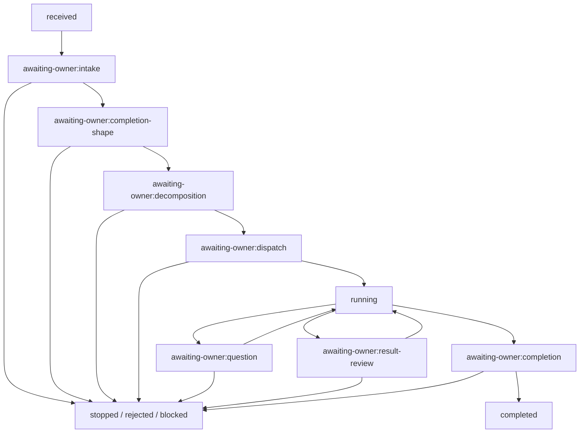

# Task — ADF-FRONTDOOR-OWNER-GATE-001: Frontdoor Owner Gate Contract

> Type: Design + Implementation
> Status: Done
> Owner: Codex
> Review: Project Owner + role-separated review
> Related: [ADF-FRONTDOOR-ORCHESTRATION-001](ADF-FRONTDOOR-ORCHESTRATION-001.md) / [ADF-FRONTDOOR-LEDGER-EVENT-SOURCING-001](ADF-FRONTDOOR-LEDGER-EVENT-SOURCING-001.md) / [Goal](../project/GOAL.md) / [Current State](../project/CURRENT_STATE.md)

## 1. Objective

ADFのFrontdoorを、AIへ一括投入する実行器ではなく、Project Ownerが依頼から完成形まで判断できる制御ループにする。窓口AIは提案・整理・集約を行えるが、Dispatch、AI質問への回答、Resultの採用、CompletionはOwnerの明示Decisionなしに進めない。

本Taskでは、CLI・Electron・将来MCPが共有するOwner Gateの状態、Decision Envelope、hash束縛、fail-closedなサービス契約を実装する。入口UIそのものは後続Taskとし、入口による抜け道を先に作らない。

## 2. Background and current gap

`ADF-FRONTDOOR-ORCHESTRATION-001`でFrontdoorRequest、分解DAG、Node状態、Question／Result集約を実装し、`ADF-FRONTDOOR-LEDGER-EVENT-SOURCING-001`でtyped hash-chain LedgerとReplayを実装した。一方、現行のFrontdoorはテストから承認済みPacketを渡す内部実行機構であり、Ownerが各段階で承認・修正・停止する共通Gateがまだ第一級の契約になっていない。

以前検討した一括CLI実行案は、Ownerの介入を飛ばすため採用しない。本Taskはその失敗条件を再発させないための基盤である。

## 3. Scope

### In scope

- Frontdoor Gateの型、状態遷移、許可Decisionの共通契約。
- Intake、Completion Shape、Decomposition、Pre-dispatch、AI Question、Result Review、Completionの7 Gate。
- `proposal`、`approved`、`dispatched`、`result-ready`、`owner-reviewed`、`completed`の状態分離。
- Decision Envelope（Owner、Run、対象hash、許可能力、data policy、時刻、Decision ID）の記録。
- Plan／Node／Result／Completionのtarget hash束縛と、古い承認・別Run・改ざんDecisionの拒否。
- `canApprove`、`canDispatch`、`canAnswer`、`canComplete`等の純粋判定ヘルパー。
- Node単位のapprove／defer／reject、Ownerによる質問回答、Result review、stop、completion approval。
- 既存Event Ledgerへのtyped Owner Decision event追加とReplay時の状態検証。
- 承認なしDispatch、Plan改訂後の旧承認再利用、質問自動回答、Result自動採用、依存Node経由の迂回を防ぐnegative test。
- 既存Frontdoor／Fake Adapter／Event Ledger／通常Thread経路の回帰検証。
- Task正本、CURRENT_STATE、Obsidianマイルストーンへの検証記録。

### Out of scope

- Electron IPC、Preload、Renderer画面、CLI入口、MCP入口の新設。
- Ollama、Anthropic、Claude Code CLIの実送信、認証、APIキー、課金。
- 自動Planner、AIによる暗黙承認、`execute-all`ショートカット、自動回答、自動Retry、自動Integration。
- Work Planeのrepo/worktree書込み、GitHub／Obsidian正本の自動変更。
- Dynamic routing、実Provider自動選定、外部独立Review Job。
- 新規外部依存、DB、常駐Worker、無制限並列。
- commit、push、merge、公開。

## 4. Owner Gate state model



Gateを飛ばす状態遷移は拒否する。`complete`は当該RunのResult／EvidenceをOwnerが受入した意味だけを持ち、GitHub／Obsidianへの統合、commit、push、merge、公開、新Taskの実行許可を含まない。

## 5. Decision contract

Owner Decisionは自然言語、UIカード移動、Snapshotの更新だけでは成立しない。Event Ledgerへ次の構造を持つDecisionとして記録し、対象の現在hashと照合する。

```ts
type OwnerDecisionEnvelope = {
  decisionId: string;
  runId: string;
  requestId: string;
  gate: OwnerGate;
  nodeId?: string;
  decision: OwnerDecision;
  targetHash: string;
  approvedBy: string;
  decidedAt: string;
  allowedCapability?: string;
  dataPolicy?: string;
  expiresAt?: string;
  note?: string;
  answerRef?: string;
};
```

推奨するtyped eventは次のとおり。

`frontdoor.owner-gate-opened`、`frontdoor.owner-decision-recorded`、`frontdoor.plan-revised`、`frontdoor.node-approved`、`frontdoor.question-answered`、`frontdoor.result-reviewed`、`frontdoor.completion-proposed`、`frontdoor.completion-approved`。

PlanやNodeが改訂された場合は新しいversion／hashを作り、旧Decisionを再利用しない。DecisionはTask／Run／PlanまたはNode、Owner、許可Capability、data policy、必要時のexpiryへ束縛する。

## 6. Service boundaries

| Surface | Responsibility | Required Owner decision |
|---|---|---|
| Intake | 依頼、不足Context、リスク、目的の提示 | clarify / edit / reject / proceed |
| Completion Shape | 成果物、受入条件、停止条件の提示 | edit / approve / reject |
| Decomposition | Node、担当、順序、依存、Adapter、能力の提示 | edit / approve selected Nodes / reject |
| Pre-dispatch | exact Packet、Plan hash、data policy、費用、対象の提示 | dispatch / defer / stop |
| AI Question | 質問、発生Node、影響、停止理由の提示 | answer / revise-plan / stop |
| Result Review | Result Envelope、Evidence、検証、衝突の提示 | accept / follow-up / reject / stop |
| Completion | 集約Result、Evidence、未解決リスク、次Task案の提示 | approve / revise / continue / stop |

サービス層は入口から呼ばれても、該当Decisionがなくtarget hashが一致しなければ処理を進めない。入口は薄くし、CLI／Electron／MCPが別々の判定を持たないようにする。

## 7. Acceptance Criteria

- [ ] OwnerがIntakeで依頼、目的、不足Context、リスク、停止条件を確認できる。
- [ ] Completion ShapeがOwner承認されるまでDecomposition／Dispatchへ進まない。
- [ ] Plan／NodeをOwnerが改訂でき、改訂前のDecisionは改訂後hashへ持ち越されない。
- [ ] 対象Node、Run、Plan hash、Capability、data policyが一致しないDispatchを拒否する。
- [ ] Node単位のapprove／defer／rejectを扱い、rejectされたNodeが依存経路からDispatchされない。
- [ ] AI QuestionはOwnerの明示answerなしに自動回答・自動継続されない。
- [ ] Result／EvidenceはOwner reviewなしに採用・Completionされない。
- [ ] Stop／Recovery後に自動Dispatch・自動Retryが発生しない。
- [ ] 別Run、別Task、別Job、別Result hashのDecision／Evidenceを受け入れない。
- [ ] Event Ledger ReplayがOwner Decisionの順序、hash、許可状態遷移を検証できる。
- [ ] `canApprove`、`canDispatch`、`canAnswer`、`canComplete`の純粋判定がUI非依存でテストできる。
- [ ] 既存テスト、node/web/cli typecheck、Electron buildがPassする。
- [ ] 実Provider送信、認証、課金、正本自動書込み、commit、pushが発生しない。

## 8. Verification and stop conditions

### Required verification

- Gate状態遷移の正常系・不正遷移テスト。
- 承認なしDispatch、変更後Planに対する旧承認、別Run Decision、質問の暗黙回答、Result自動採用、依存Node迂回、Recovery後Retryのnegative tests。
- Event LedgerのReplay、Decision hash束縛、重複／順序逆転／改ざん拒否。
- 既存Frontdoor、Fake Adapter、Thread、Adapter Registry、Event Ledgerの回帰テスト。
- `tsc --noEmit -p tsconfig.node.json`、`tsc --noEmit -p tsconfig.web.json`、`tsc -p tsconfig.cli.json`、Vitest、`electron-vite build`、`git diff --check`。
- Skill validatorが実行できない場合は、環境原因と代替のfrontmatter検証を記録する。

### Stop conditions

- 同じ原因による検証失敗が2回連続、または異なる原因でも3回続いたら、実装を止めてProject Ownerへ確認する。
- 新規依存、外部送信、認証、費用、Work Plane書込み、既存安全境界の弱体化が必要になったら停止する。
- Owner Gateを省略する経路、`execute-all`、自動Answer、自動Integrationを作る必要が生じたら停止する。

## 9. Implementation boundary

実装対象はFrontdoor共通契約、Service、Event Ledger統合、negative testに限定する。IPC／Renderer／CLI／MCPの実入口は、共通契約が確定した後の別Taskで一つずつ実装する。次候補は以下のいずれか一つとする。

- `ADF-FRONTDOOR-CLI-OWNER-LOOP-001`: CLIでOwnerが各Gateを操作する入口。
- `ADF-FRONTDOOR-UI-IPC-001`: Electron ThreadPanel／Frontdoor画面と共通Serviceを接続する入口。

どちらを先にするかは本Taskの完了後にProject Ownerが決める。両方を本Taskへ混ぜない。

## 10. Approval request

2026-08-14、Project Ownerの`設計OK`を受領し、次の範囲で実装を開始した。

1. Owner Gate 7段階と状態遷移を共通契約として採用すること。
2. Dispatch、AI回答、Result採用、CompletionをOwner Decision必須にすること。
3. `complete`をRunのResult／Evidence受入に限定し、正本統合や次Task実行を別承認とすること。
4. CLI／Electron／MCP入口を本Taskの後続へ分離すること。
5. 上記Scopeで実装・テストを開始すること。承認済み。

設計承認までは`src/`、設定、依存、実行、外部送信、commit、pushを変更しない。

## 11. Handover

本Task完了時には、共通Gate契約、Decision hash束縛、Replay検証、negative testsを次Taskが利用できる状態にする。入口TaskはOwnerが選択し、入口からAIへ作業を投げる際も本TaskのGateを迂回しない。

## 12. Design log

| 日時 | 実施者 | 内容 |
|---|---|---|
| 2026-08-14 | Codex | Frontdoor OrchestrationとEvent Ledgerの現状、Owner Gate Skill、役割分離テンプレート、Obsidian方針を確認。Owner介入を欠く一括実行案を不採用とした。 |
| 2026-08-14 | Codex | 本Taskを設計のみで作成。`src/`変更、依存追加、外部送信、commit、pushは未実施。 |

## 13. Implementation log

| 日時 | 実施者 | 内容 |
|---|---|---|
| 2026-08-14 | Codex | `OwnerGate`、`OwnerDecisionEnvelope`、Owner Gate状態、typed event型を追加。Intake／Completion Shape／Decomposition／Dispatch／Question／Result Review／CompletionのDecision契約を共有化。 |
| 2026-08-14 | Codex | `ownerGates.ts`を追加し、target hash計算、`canApprove`／`canDispatch`／`canAnswer`／`canReviewResult`／`canComplete`、前段Gate承認、Node hash束縛、質問・Result・Completion操作を実装。 |
| 2026-08-14 | Codex | `executeApprovedRun()`をOwner Dispatch Decision必須へ変更。Result生成後は`awaiting-owner`で停止し、`reviewResult()`と`completeRun()`を経由しない限り完了イベントを発行しない。 |
| 2026-08-14 | Codex | Event Ledger ReplayでOwner DecisionのRun／Request／target hash、Node approval、Question／Result／Completion eventの束縛を検証。Recovery／Stop時のownerGate Projectionも同期。 |
| 2026-08-14 | Codex | 既存Frontdoorテストを前段3Gate＋Dispatch承認経由へ移行し、Owner Gate negative testsを追加。 |

## 14. Verification log

### Verification result

- Vitest: **293/293 Pass**（288件からOwner Gateテスト5件を追加）。
- `tsc --noEmit -p tsconfig.node.json`: Pass。
- `tsc --noEmit -p tsconfig.web.json`: Pass。
- `tsc -p tsconfig.cli.json`: Pass。
- `electron-vite build`: Pass（Main 120.16 kB、Preload／Rendererは既存出力を維持）。
- `git diff --check`: Pass。

### Negative tests and evidence

- Owner DecisionなしDispatchを拒否し、`approval-bound`／`node-started`／Threadを生成しない。
- Intake／Completion Shape／Decomposition未承認のDispatchを拒否する。
- stale dispatch target、Node target hash不一致、別RunのQuestion、質問内容なしのAnswerを拒否する。
- 別Run由来のAggregate／QuestionをResult Review・Answerの対象にできない。
- Result ReviewなしのCompletionを拒否し、`result-reviewed`後だけ`completion-approved`／`run-completed`を許可する。
- Event ReplayでDecision重複、Run束縛不一致、Node approval未束縛、Result／Completion event未束縛を拒否する。
- Recovery／Stop後に自動Retryを追加せず、既存Recovery回帰もPassした。

### Scope confirmation

- Electron IPC／Preload／Renderer、CLI入口、MCP入口は変更していない。
- Ollama／Anthropic／Claude Code CLIの実送信、認証、APIキー、課金は行っていない。
- Work Plane、repo/worktree、GitHub／Obsidian正本の自動書込みは行っていない。
- commit／pushは未実施。

### Independent review

- Safety／Critic subagentは、暗黙Packet承認、Owner DecisionなしCompletion、Replay束縛不足を指摘した。
- 指摘を反映し、前段Gate必須化、Node hash束縛、Questionの現在Run照合、Result Review／Completion分離、Replay検証を追加した。
- 追加の独立実行検証は同一ローカル環境のため、外部AIレビューとは主張しない。

### Residual risk

- CLI／Electron／MCPからOwner Gateを操作する入口は未実装で、後続Taskとする。
- Intake／Completion Shape／Decompositionの表示・編集UIは未実装で、今回のService契約を利用する後続入口で扱う。
- 実Provider送信と実AI品質は未検証。

## 15. Current status

`Done`。2026-08-14、Project Ownerの最終Diff・検証レビューと`Done`承認を受領した。共通Owner Gate契約、Event Ledger統合、negative tests、自動検証を完了した。入口実装、実Provider接続、commit、pushは別承認・別Taskとする。

## 16. Completion

- Project Owner最終承認: `Done`（2026-08-14）
- Vitest 293/293、node/web/cli typecheck、Electron build、diff check: Pass
- 実Provider送信、認証、CLI／Electron／MCP入口追加: 未実施（後続Task）
- commit／push: 未実施（別承認待ち）
