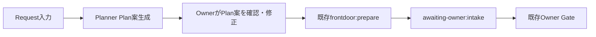

# Task — ADF-FRONTDOOR-PLANNER-PROPOSAL-001: Planner Proposal

> Type: Design + Implementation
> Status: Done
> Owner: Codex
> Review: Project Owner + role-separated review
> Branch: `codex/adf-frontdoor-planner-proposal`
> Related: [ADF-FRONTDOOR-REQUEST-INTAKE-001](ADF-FRONTDOOR-REQUEST-INTAKE-001.md) / [ADF-FRONTDOOR-OWNER-GATE-001](ADF-FRONTDOOR-OWNER-GATE-001.md) / [ADF-FRONTDOOR-ORCHESTRATION-001](ADF-FRONTDOOR-ORCHESTRATION-001.md) / [Goal](../project/GOAL.md) / [Current State](../project/CURRENT_STATE.md)

## 1. Objective

Request Intakeで手入力しているPlan JSONを、ADF内のProvider-neutralなPlanner契約から安全なPlan案として生成・表示できるようにする。

Plannerは候補を提案するだけであり、Plan案の提示、Run作成、Intake承認、Decomposition承認、Dispatchを分離する。本Taskでは決定的なFake Plannerを使い、実AI Plannerの品質や外部接続は検証しない。

## 2. Goal alignment



本Taskは最終目標「窓口AI → ADF → 得意分野ごとの複数AI → ADF → 窓口AI」のうち、窓口依頼から安全な分解案を作る区間を埋める。

## 3. Required context and adopted constraints

### GitHub

- `docs/project/GOAL.md` — ADFはAIの推論ではなく、進捗管理・受け渡し・Evidenceを担う。
- `docs/project/MVP.md` — ローカルFake AI討論とOwner Reviewを先に成立させる。
- `docs/project/ROADMAP.md` — 実AI、MCP、Work Plane、動的Routingは別段階で扱う。
- `docs/project/CURRENT_STATE.md` — Frontdoor、Owner Gate、Event Ledger、Adapter基盤、Ollama接続は既存資産として利用する。
- `docs/tasks/ADF-FRONTDOOR-REQUEST-INTAKE-001.md` — Request／Plan検証と既存Prepare経路を再利用する。
- `docs/tasks/ADF-FRONTDOOR-OWNER-GATE-001.md` — Plan提示とOwner承認を混同しない。
- `docs/tasks/ADF-FRONTDOOR-ORCHESTRATION-001.md` — Blocked Taskの完全Event-Sourcing拡張を再開しない。

### Obsidian

- `16_ChatGPT_ADF_各AI自動往復構想_2026-08-07.md` — 窓口AIからADFを経由して各AIへ渡し、結果を窓口へ戻す。
- `06_複数AI管制エンジン設計_2026-08-04.md` — Control／Work／Evidenceを分離する。
- `25_ADF_Frontdoor_Request_Intake_2026-08-14.md` — Request IntakeはOwner Intake Gate前で停止する。

## 4. Scope

### In scope

- Provider-neutralなPlanner契約を追加する。
- Requestから決定的な`DecompositionPlanInput`案を生成するFake Plannerを追加する。
- 生成Planを既存`createDecompositionPlan()`で検証し、ADF側で`planHash`を再計算する。
- Request hash、Plan hash、Planner version、前提、リスクをUI／結果として確認できるようにする。
- ElectronのRequest Intakeに「Plan案を生成」を追加する。
- OwnerがPlan案を確認・修正した後、既存`frontdoor:prepare`でRun化できるようにする。
- Planner案生成だけではRun、Job、Thread、Packet、Decision、Dispatchを生成しない。
- Planner、Prepare、Owner Gateの契約テストとnegative testを追加する。

### Out of scope

- Ollama、Anthropic、Claude Code CLIなど実AI Plannerの接続。
- APIキー、認証、外部送信、課金、Providerの実ネットワーク通信。
- 自動承認、自動Dispatch、自動Retry、自動Answer。
- 動的Routing、任意Adapter、未承認Adapterの自動選択。
- GitHub／Obsidian／Task正本の自動書込み。
- Work Plane、repo／worktree、ファイル編集、commit対象の自動生成。
- `ADF-FRONTDOOR-ORCHESTRATION-001`の完全Event-Sourcing再拡張。

## 5. Contract and flow

### Planner contract

```ts
interface FrontdoorPlanner {
  readonly plannerId: string
  readonly version: string
  propose(request: FrontdoorRequest): Promise<FrontdoorPlanProposal>
}
```

`FrontdoorPlanProposal`はRequestの`inputHash`、Planner ID／version、候補Plan、前提、リスクを含む。Plannerが返すhashを信頼せず、ADFがPlan検証後にhashを導出する。

### Authority boundary

| 段階 | 作成物 | Owner承認 |
|---|---|---|
| Planner proposal | 未承認Plan案 | 不要。ただし提案であることを表示 |
| Prepare | Frontdoor Run／Event Ledger | Intake Gate待ち |
| Decomposition approval | Plan hashに束縛されたDecision | 必須 |
| Dispatch | 承認済みNodeのJob／Thread | 必須 |

Plan案生成は既存Owner Gateを短絡しない。Plan案生成だけでRuntime Ledgerへ実行状態を作らず、Ownerが明示的にRun化したときだけ既存Prepareへ渡す。

## 6. Acceptance criteria

- [x] 有効なRequestから決定的なPlan案を生成できる。
- [x] 同一Requestと同一Planner versionから同じPlan案が生成される。
- [x] `createDecompositionPlan()`でScope、Context、Capability、Adapter、Node数、深さ、DAGを再検証できる。
- [x] `requestHash`と`planHash`をADF側で再計算・表示できる。
- [x] 未知／未提供／external-send Adapter、越権Capability、越権Scope、循環DAGを拒否する。
- [x] Plan案生成だけではRun、Job、Thread、Packet、Decision、Dispatch、外部送信が発生しない。
- [x] Ownerが確認して既存Prepareを実行した場合のみ`awaiting-owner:intake`のRunが生成される。
- [x] Plan改訂は新しいPlan hashとして扱い、古い承認を再利用しない。
- [x] ElectronのRequest IntakeでPlan案を確認・修正してからRun化できる。
- [x] 既存Frontdoor、Owner Gate、Fake Adapter、Ollama readiness、External Adapter経路に回帰がない。
- [x] node/web/cli typecheck、Vitest、Electron build、`git diff --check`がPassする。

## 7. Verification and stop conditions

### Required verification

- Planner契約の正常系・決定性・version差分テスト。
- Request／Plan hash再計算と改ざん拒否テスト。
- Scope、Context、Capability、Adapter、DAG、上限のnegative test。
- Planner proposalからJob／Thread／Dispatchへ到達しないことのテスト。
- Owner確認後のPrepareが`awaiting-owner:intake`で停止するテスト。
- Plan改訂後の古いDecision／hash拒否テスト。
- ElectronのPlan案表示・修正・Run化の表示確認。
- 既存全テスト、typecheck、build、diff check。

### Stop conditions

- 実AI、外部API、認証、費用、ネットワークが必要になった場合。
- Planner案がOwner承認なしにRun／Dispatchへ進む設計になった場合。
- 新しいLedger／Replay基盤の拡張が必要になった場合。
- `ADF-FRONTDOOR-ORCHESTRATION-001`のBlocked範囲を再開しないと成立しない場合。
- 同じ原因の検証失敗が2回連続、または別原因が3回続いた場合。
- 既存Owner Gate、Adapter、Thread、Recoveryの安全境界を弱める必要が出た場合。

## 8. Implementation boundary

変更候補は次に限定する。

- `src/shared/frontdoorTypes.ts`
- `src/main/frontdoor/planner.ts`
- `src/main/frontdoor/frontdoorService.ts`
- `src/main/index.ts`
- `src/preload/index.ts`
- `src/renderer/src/env.d.ts`
- `src/renderer/src/FrontdoorPanel.tsx`
- `src/renderer/src/styles.css`
- Planner／Frontdoor IPC／Prepare tests
- 本Task、`CURRENT_STATE.md`、Obsidianマイルストーン

`orchestrator.ts`、`ownerGates.ts`、`eventLedger.ts`、`relay.ts`、External Transport、既存Adapter契約は原則変更しない。

## 9. Implementation log

| 日時 | 実施者 | 内容 |
|---|---|---|
| 2026-08-14 | Codex | 既存Frontdoor、Owner Gate、Event Ledger、Adapter Registry、Ollama実証、Fake討論、Recovery、UI／IPCを確認し、最終目標の次の欠落区間をPlanner Proposalと特定した。 |
| 2026-08-14 | Product／Architecture／Safety review | Planner案、Prepare、Intake承認、Decomposition承認、Dispatchを分離する設計を合意した。実AI Plannerは別Taskへ分離する。 |
| 2026-08-14 | Project Owner | `設計OK`。本Taskの実装開始を承認。 |
| 2026-08-14 | Codex | `FrontdoorPlanner`契約、決定的`DeterministicFakePlanner`、`frontdoor:propose-plan` IPC、Preload／RendererのPlanner案表示を実装。既存PrepareとOwner Gateは再利用し、Planner案生成だけではRun／Job／Thread／Dispatchを作成しない。 |
| 2026-08-14 | Codex | Planner IPC例外時のBusy解除と、成功メッセージを失敗表示しないUI表現を追加。 |
| 2026-08-14 | Codex | Vitest 310/310、node/web/cli typecheck、Electron build、`git diff --check`を確認。最新`out/main/index.js`を直接起動し、Request入力→Planner案生成を実UIで確認。`fake-planner/v1`、Proposal／Critic 2ノード、Request hash／Plan hash、前提／リスク、未承認表示を確認し、既存Run一覧に新Runが増えないことを確認した。 |
| 2026-08-14 | Codex | 最終Diff確認後にcommit `e63e7c0`、push、PR #4を実施。PR #4はmerge commit `bcaece2`で`main`へマージ済み。 |

## 10. Current status

`Done`。決定的Fake Planner、共通Service、Electron Plan案表示、契約テストの実装、自動検証、最新Electron Main／RendererでのPlanner案生成確認、最終Diff確認、commit／push、PR #4の`main`マージまで完了した。外部送信、認証、APIキー、Ollama実行、正本自動書込みは行っていない。

## ADF Execution Summary

```json
{
  "taskId": "ADF-FRONTDOOR-PLANNER-PROPOSAL-001",
  "objective": "RequestからOwner承認前の決定的なDecomposition Plan案を生成し、既存Frontdoor Prepareへ安全に渡せるようにする",
  "scope": {
    "inScope": [
      "provider-neutral planner contract",
      "deterministic fake planner",
      "plan validation and hash recomputation",
      "Electron plan proposal display",
      "explicit prepare handoff",
      "negative and regression tests"
    ],
    "outOfScope": [
      "real AI planner",
      "external send/auth/payment",
      "auto-approval/auto-dispatch",
      "dynamic routing",
      "Work Plane",
      "canonical GitHub or Obsidian writes"
    ]
  },
  "approval": {
    "status": "approved",
    "approvedBy": "Project Owner",
    "approvedAt": "2026-08-14",
    "externalSend": false,
    "newDependencies": false
  },
  "verification": {
    "status": "done",
    "tests": "310/310 passed",
    "typecheck": ["node", "web", "cli"],
    "electronBuild": "pass",
    "diffCheck": "pass",
    "uiSmoke": "latest out/main/index.js: Planner proposal displayed as unapproved; no new Run/Job/Thread/Dispatch"
  }
}
```
