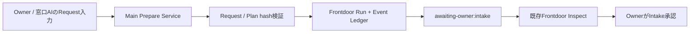

# Task — ADF-FRONTDOOR-REQUEST-INTAKE-001: Frontdoor Request Intake

> Type: Design + Implementation
> Status: Done
> Owner: Codex
> Review: Project Owner + role-separated review
> Branch: `codex/adf-frontdoor-request-intake`
> Related: [ADF-FRONTDOOR-UI-IPC-001](ADF-FRONTDOOR-UI-IPC-001.md) / [ADF-FRONTDOOR-ORCHESTRATION-001](ADF-FRONTDOOR-ORCHESTRATION-001.md) / [Goal](../project/GOAL.md) / [Current State](../project/CURRENT_STATE.md)

## 1. Objective

窓口AIまたはProject Ownerが作成したRequest／Plan案を、既存のFrontdoor準備経路へ安全に投入し、Owner Intake Gate待ちのRunとしてElectronへ表示できるようにする。

本Taskは最終目標の最初の欠落区間である「窓口AI／Owner → ADF Intake」を埋める。Plannerや実Provider接続は同時に追加せず、Request／Planの受け付けと証跡化だけを実装する。

## 2. Scope

### In scope

- 既存`FrontdoorOrchestrator.createRun()`へ委譲する共通Prepare Service。
- CLIのFrontdoor prepareを共通Prepare Service経由へ整理。
- ElectronのRequest／Plan入力UIと`frontdoor:prepare` IPC。
- Request、Plan、Node、Adapter、Capability、Scope、DAGのMain側検証。
- Request hash、Plan hash、Run ID、`frontdoor.run-created`の生成・表示。
- 同一Request IDの同一内容再送は既存Runを返し、内容差分は拒否する冪等性境界。
- Prepare後は必ず`awaiting-owner:intake`で停止し、既存Owner Gateへ接続する。
- Unit／integration／negative testとElectron表示確認。

### Out of scope

- AIによる自動Planner、自動分解、自動承認、自動Dispatch。
- Task Packet生成、Job／Thread作成、Adapter送信、Result生成。
- Ollama、Anthropic、Claude Code CLI、APIキー、認証、課金、外部送信。
- GitHub／Obsidian／Task正本への自動書込み。
- repo／worktree／Work Plane操作、commit、push、merge。
- 複数Projectの同時管理、常駐Worker、DB、バックグラウンドPolling。

## 3. User flow

入力フォームはRequest情報とPlan案を明示的に入力する。Prepare時点でAI・Job・Threadには到達しない。Plan案の自動生成は後続Taskとする。

## 4. Authority and data boundary

- Rendererは入力と表示だけを担当し、Request／Planの有効性はMainが判定する。
- Mainは`createFrontdoorRequest()`、`createDecompositionPlan()`、既存`FrontdoorOrchestrator`を再利用する。
- Prepare時点ではOwner Decision、Approved Task Packet、Job、Thread、Adapter送信を生成しない。
- Request／PlanはRuntime LedgerのFrontdoor Run証跡として保存するが、GitHub／Obsidian正本は変更しない。
- UI表示、Request ID、Plan hashだけでは承認扱いにしない。
- 認証情報、環境変数、任意パス、秘密情報はRenderer／IPC payload／Ledgerへ渡さない。

## 5. Acceptance Criteria

- [ ] ElectronからRequest／Plan案を入力して新しいFrontdoor Runを生成できる。
- [ ] 生成直後のRunが`ready-for-approval`かつ`awaiting-owner:intake`で停止する。
- [ ] Request hash、Plan hash、Run ID、Run-created Eventが生成され、既存Inspectへ表示される。
- [ ] 不正Request、Plan、DAG、Capability、Adapter、ScopeをMain側で拒否する。
- [ ] 同一Request ID・同一内容の再送は二重Runを作らず、内容差分は拒否する。
- [ ] PrepareだけではJob、Thread、Packet、Adapter送信、外部通信が発生しない。
- [ ] CLIとElectron IPCが同じPrepare Serviceを利用する。
- [ ] 既存Owner Gate、Fake Adapter、Frontdoor UI／IPCの回帰がない。
- [ ] node/web/cli typecheck、Vitest、Electron build、`git diff --check`がPassする。

## 6. Verification and stop conditions

### Required verification

- 正常Request／Plan生成とInspect表示。
- Request／Plan hash改ざん、DAG循環、未知Adapter、越権Capability、別Project、重複Requestのnegative test。
- Prepare後にJob／Thread／Packet／Adapter送信が存在しないことのtest。
- Owner identityなしではIntake承認できないことの既存Gate回帰test。
- CLI／IPCが共通Prepare Serviceを利用することのintegration test。
- Electron実機で入力→Run表示→Inspect確認。承認操作はOwner意思決定を代行しない。

### Stop conditions

- Planner、自動承認、自動Dispatch、実Provider接続が必要になる。
- GitHub／Obsidian／Task正本への自動書込みが必要になる。
- 新規依存、外部通信、認証、費用、Work Plane操作が必要になる。
- 同じ原因の検証失敗が2回連続、または別原因が3回続く。
- 既存Frontdoor Gate／Event Ledgerを迂回する新しい状態遷移が必要になる。

## 7. Implementation boundary

変更候補は次に限定する。

- `src/main/frontdoor/frontdoorService.ts`または専用Prepare Service
- `src/main/index.ts`
- `src/cli/frontdoorOwnerLoop.ts`
- `src/preload/index.ts`
- `src/renderer/src/env.d.ts`
- `src/renderer/src/FrontdoorPanel.tsx`
- `src/shared/frontdoorTypes.ts`
- Frontdoor／CLI／IPC tests、Task正本、CURRENT_STATE、Obsidianマイルストーン

`ConversationRelay`、Thread／Turn契約、External Transport、Adapter送信契約、GitHub／Obsidian連携は変更しない。

## 8. Implementation log

| 日時 | 実施者 | 内容 |
|---|---|---|
| 2026-08-14 | Codex | `ADF-FRONTDOOR-UI-IPC-001`完了後の現在地を確認。窓口からADFへ新規Requestを投入するUI／IPCが未実装であることを確認した。 |
| 2026-08-14 | Product／Architecture／Safety review | 次の最小TaskをRequest Intakeへ一致させた。Planner、実Provider、認証、Packet生成は後続へ分離する。 |
| 2026-08-14 | Project Owner | `設計OK`。実装開始を承認。 |

| 2026-08-14 | Codex | `frontdoorPrepareService.ts`を追加し、Request／Planの事前検証、静的Registry由来のlocal-only Adapter検証、Request IDの重複再利用・内容差分拒否、既存`FrontdoorOrchestrator.createRun()`への委譲を実装した。 |
| 2026-08-14 | Codex | CLI `prepare`を共通Prepare Serviceへ委譲し、`frontdoor:prepare` IPC、Preload、共有型、Electron Request Intakeフォームを追加した。PrepareはRun／Event Ledgerだけを作成し、Owner Intake Gateで停止する。 |

## 9. Verification

- 対象テスト：**37/37 Pass**（Request Prepare、Frontdoor IPC、CLI、既存IPC）
- 全テスト：**306/306 Pass（25 files）**
- `tsc --noEmit -p tsconfig.node.json`：Pass
- `tsc --noEmit -p tsconfig.web.json`：Pass
- `tsc -p tsconfig.cli.json`：Pass
- `electron-vite build`：Pass（main 194.15 kB、preload 2.48 kB、renderer 576.81 kB、CSS 11.25 kB）
- `git diff --check`：Pass
- Electron実機：Request Intakeの見出し、必須目的・依頼欄、Plan案 JSON欄、`Run案を作成（Intake待ち）`ボタンを表示確認。入力送信・Run生成・Owner承認・Dispatchは未実行。
- Negative：unsafe Request ID、unknown Adapter、external-send Adapter、同一Request IDの内容差分を拒否。同一Request／Planの再送は既存Runを再利用することを確認。
- 安全境界：Prepare時点のThread／Job／Packet／Adapter送信なし。外部送信、認証、APIキー、GitHub／Obsidian正本書込みなし。

## 10. Current status

`Done`。実装、自動検証、Electron Request Intake表示確認まで完了した。入力送信・Run生成・Owner承認・DispatchはOwner意思決定を代行しないため自動実行していない。入力受付の共通Prepare ServiceとMain／IPC／CLI経路はテストで検証済みであり、実Provider・認証・外部送信は本Taskの対象外として実施していない。完了承認後、専用ブランチからcommit・push・PRマージを行う。

## 11. Completion record

- Project Ownerの実装完了承認を受領した。
- `ADF-FRONTDOOR-REQUEST-INTAKE-001`の実装範囲、テスト、Electron表示確認、非送信境界を最終確認した。
- 入力送信はRun作成を伴うためOwner操作として自動実行せず、Owner Intake Gate前で停止する設計を維持した。
