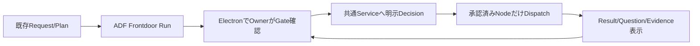

# Task — ADF-FRONTDOOR-UI-IPC-001: Electron Frontdoor Owner Loop

> Type: Design + Implementation
> Status: Done
> Owner: Codex
> Review: Project Owner + role-separated review
> Related: [ADF-FRONTDOOR-OWNER-GATE-001](ADF-FRONTDOOR-OWNER-GATE-001.md) / [ADF-FRONTDOOR-CLI-OWNER-LOOP-001](ADF-FRONTDOOR-CLI-OWNER-LOOP-001.md) / [Goal](../project/GOAL.md) / [Current State](../project/CURRENT_STATE.md)

## 1. Objective

完了済みの`FrontdoorOrchestrator`／`FrontdoorOwnerGateService`／Event Ledgerを、既存ElectronアプリからProject Ownerが一段ずつ操作できる読み取り・承認UIへ接続する。

CLIで確立したGate契約を再利用し、Rendererは表示と明示操作だけを担当する。Electron入口独自の承認判定、hash計算、状態遷移、Result採用、自動実行は持たせない。

## 2. Goal alignment

本Taskは最終目標の次の区間を実証する。

窓口AIによる自動分解、実Provider接続、Work Plane、正本統合は本Taskの完了条件に含めない。既存CLIの`prepare`で作成したRunをElectronで確認・操作できることを最小実証とする。

## 3. Scope

### In scope

- Main側にFrontdoor用の読み取り・Owner操作Service wrapperを追加する。
- IPC／Preload／Rendererに、Frontdoor Run一覧と選択RunのInspect Projectionを公開する。
- Intake、Completion Shape、Decomposition、Dispatch、Question、Result Review、Completion、Stop、Recoveryを個別操作として表示する。
- Decision対象のRun／Plan／Node／Aggregate hash、Owner identity、data policy、capability、次のActionを表示する。
- `approve`、`dispatch`、`answer`、`review-result`、`complete`、`stop`、`recover`の明示ボタンを共通Serviceへ接続する。
- IPC入力をMain側で検証し、不正Run、stale hash、未承認、別Run、無効なGate操作をfail-closedにする。
- Rendererの状態更新は操作結果の再取得を正本とし、楽観的にGateを進めない。
- UI／IPC／Preloadのunit・integration・negative testを追加する。

### Out of scope

- 新しいPlanner、AIによる自動分解、自動承認、`execute-all`。
- UIからの自由なPacket／承認ファイル作成、Task正本・GitHub・Obsidianへの自動書込み。
- Ollama、Anthropic、Claude Code CLIの実送信、認証、APIキー、課金。
- Work Planeのrepo／worktree接続、ファイル編集、commit、push、merge。
- MCP／HTTP入口、常駐Worker、DB、無制限並列、Provider自動Failover。
- 大幅なThreadPanelの再設計。既存Thread UIとの共存を優先する。

## 4. UI minimum

既存AppにFrontdoorセクションを追加する。画面は次の4領域に限定する。

1. **Run一覧**：Run ID、目的、現在Gate、状態、更新時刻。
2. **Proposal／Plan**：Request、完成形、Plan、Node、担当Adapter、capability、data policy、依存、acceptance、stop conditions、hash。
3. **Owner Decision**：現在Gateで許可される操作だけを表示し、Owner名・noteを明示入力する。
4. **Result／Evidence／Question**：Aggregate、Evidenceリンク、未解決Question、Result review、次Action、残存リスク。

`inspect`は読み取り専用で、Run選択・画面更新・PollingではDecisionや送信を発生させない。更新は初回表示、Owner操作後、明示Refreshに限定し、常時Pollingは行わない。

## 5. IPC contract

Mainの共通Service wrapperを介して、次のIPCを公開する。

| IPC | 種別 | 内容 |
|---|---|---|
| `frontdoor:list` | read | Runtime内のFrontdoor Run一覧 |
| `frontdoor:inspect` | read | `FrontdoorInspection`全体。hash／Decision／Evidence／Questionを含む |
| `frontdoor:approve` | Owner action | Gateごとの肯定Decisionを記録。`approvedBy`必須 |
| `frontdoor:dispatch` | Owner action | 明示された承認済みNodeだけをDispatch |
| `frontdoor:answer` | Owner action | 現在のQuestionへの回答を記録。自動再Dispatchなし |
| `frontdoor:review-result` | Owner action | `accept`／`follow-up`／`reject`を記録 |
| `frontdoor:complete` | Owner action | Result／Evidence受入を記録。正本統合なし |
| `frontdoor:stop` | Owner action | Stop Decisionを記録しRunを停止 |
| `frontdoor:recover` | Owner action | Recovery状態を確認・記録。自動Retryなし |

`frontdoor:prepare`は本Taskでは追加しない。Run生成は既存CLIまたは後続の窓口入力Taskで行い、UIは既存Runを安全に操作する。

## 6. Authority and data boundary

- RendererはDecisionの提案と入力だけを行い、Decisionの有効性はMain／共通Serviceが判定する。
- IPC payloadにRun ID、対象hash、Gate、Decision、Owner identity、noteを含めるが、Mainは現在Ledgerと再計算したhashを正本とする。
- Rendererの古いInspect結果をそのまま承認に使わず、操作時にMainが最新Runを再読込する。
- `frontdoor:dispatch`は既存`assertDispatchApproved`とOrchestratorを通し、未承認Node・別Plan・stale hashを拒否する。
- Rendererへ任意のRuntimeパス、認証情報、環境変数、外部Transport内部情報を公開しない。
- IPCからTask正本、approved-tasks、repo/worktreeへ書き込まない。

## 7. Acceptance Criteria

- [ ] Electron上で既存Frontdoor Runを一覧・選択・Inspectできる。
- [ ] InspectにRequest／Plan／Node／Aggregate hash、現在Gate、Decision、Evidence、Question、次Actionが表示される。
- [ ] Intake／Completion Shape／Decomposition／Dispatchを一つずつ明示承認できる。
- [ ] Owner identityなし、無効Decision、stale hash、別Run、未承認Nodeの操作がMain側で拒否される。
- [ ] Dispatchは承認済みNodeだけを対象にし、Rendererの表示状態だけでは実行されない。
- [ ] Question回答後に自動Dispatchされず、明示的なDispatch承認待ちとして表示される。
- [ ] Result ReviewとCompletionが別操作として表示・記録される。
- [ ] Stop／Recoveryから自動Retry、自動Answer、自動Integrationが発生しない。
- [ ] UI操作後はServiceからInspectを再取得し、Event Ledger由来の状態と一致する。
- [ ] 既存Thread／Fake Adapter／Ollama readiness／外部Adapterの経路に回帰がない。
- [ ] 実Provider送信、認証、APIキー、課金、正本自動書込み、Work Plane書込みが発生しない。
- [ ] node/web/cli typecheck、Vitest、Electron build、`git diff --check`がPassする。
- [ ] Electron起動後、Fake Adapter限定でRun表示→Gate承認→Dispatch→Result review→Completionの実機操作を確認する。

## 8. Verification and stop conditions

### Required verification

- IPC payloadの型・入力検証テスト。
- Run／Plan／Node／Aggregateのhash改ざん、別Run、stale UI、未承認Decisionのnegative test。
- RendererがDecisionなしでDispatchしないことのintegration test。
- Question後の自動Dispatchなし、Result reviewなしCompletion拒否、Stop／Recovery後Retryなしのtest。
- 既存ThreadPanel、Live Board、External Adapter UIの回帰test。
- Electron実機でのRun選択、Gate操作、Result／Evidence表示、拒否理由表示。
- node/web/cli typecheck、Vitest、Electron build、diff check。

### Stop conditions

- Owner Gateを省略するUI導線が必要になった場合。
- Rendererから承認ファイル、正本、repo／worktreeへ書く必要が生じた場合。
- 新規依存、外部送信、認証、課金、Work Planeが必要になった場合。
- 同じ原因の検証失敗が2回連続、または別原因が3回続いた場合。
- ThreadPanelの大幅改修なしに既存経路を保てない場合。

## 9. Implementation boundary

変更候補は次に限定する。

- `src/main/frontdoor/`または`src/main/relayService.ts`
- `src/main/index.ts`
- `src/preload/index.ts`
- `src/renderer/src/env.d.ts`
- `src/renderer/src/App.tsx`またはFrontdoor専用Renderer component／style
- `src/shared/frontdoorTypes.ts`（IPC共有型が必要な場合のみ）
- Frontdoor IPC／Renderer test、Task正本、CURRENT_STATE、Obsidianマイルストーン

`ConversationRelay`、Thread／Turn契約、External Transport、既存CLIのGate判定は変更しない。変更が必要になった場合は設計を止め、追加Taskへ分離する。

## 10. Approval request

Project Ownerに次を承認依頼する。

1. CLIで確立したFrontdoor Service／Event LedgerをElectron UI／IPCから再利用すること。
2. UIは既存RunのInspectとOwner Decision操作に限定し、`prepare`／Planner／自動分解は後続へ分離すること。
3. Rendererは表示と明示入力のみ、Main／Serviceを唯一の判定・正本経路とすること。
4. 実Provider、認証、外部送信、Work Plane、正本自動書込みを行わないこと。
5. 設計承認後、実装・自動検証・Electron実機確認へ進むこと。

## 11. Handover

本Task完了時には、OwnerがElectron上でFrontdoor Runを確認し、Gateごとに承認・停止・質問回答・Result受入を行える状態にする。次候補は窓口入力／Request生成Taskで、UIから新しいRequest／Planを作る範囲は別設計とする。

## 12. Design log

| 日時 | 実施者 | 内容 |
|---|---|---|
| 2026-08-14 | Codex | `ADF-FRONTDOOR-CLI-OWNER-LOOP-001`のDoneと`801ced8`／`5a62a9a`のpushを確認。CLIで確立した共通ServiceをElectronへ接続する次段を設計した。 |
| 2026-08-14 | Codex | UIは既存RunのInspect／Owner操作に限定し、Request生成・Planner・自動分解を後続へ分離する設計とした。 |

## 13. Implementation log

| 日時 | 実施者 | 内容 |
|---|---|---|
| 2026-08-14 | Codex | `frontdoorService.ts`を追加し、既存`FrontdoorOrchestrator`のlist／inspect／Owner Decision／dispatch／question／review／complete／stop／recoverを薄いMain Service wrapperとして公開した。Rendererから任意Packetを受け取らず、Dispatch時はRuntimeの承認済みTask PacketをMain側で再読込する構成とした。 |
| 2026-08-14 | Codex | `index.ts`へ9 IPC、Preload、共有型、`FrontdoorPanel`、App統合、専用CSSを追加した。Owner identityを必須入力とし、明示Refresh・操作後再取得・自動承認／自動Dispatch／自動Answer／自動Retryなしを実装した。 |
| 2026-08-14 | Codex | `frontdoorIpc.test.ts`を追加し、read-only list／inspect、Owner identity必須、無効Gate拒否、Packet未配置拒否、承認済みPacketによるDispatch、Result Review、Completionの一周を検証した。既存IPCテストは新規Frontdoor channelを含む形へ更新した。 |

## 14. Verification

- `tsc --noEmit -p tsconfig.node.json`：Pass
- `tsc --noEmit -p tsconfig.web.json`：Pass
- `tsc -p tsconfig.cli.json`：Pass
- `vitest run`：**303/303 Pass（24 files）**
- Frontdoor／既存IPC targeted test：**27/27 Pass**
- `electron-vite build`：Pass（main 190.36 kB、preload 2.40 kB、renderer 569.20 kB、CSS 10.78 kB）
- `git diff --check`：Pass
- Electron実機：開発Electronを起動し、Frontdoor Owner LoopのRun一覧、Run選択、Inspect Projection、Request／Plan／Aggregate hash、現在Gate、Event、Owner identity入力欄を確認した。承認・Dispatch・外部送信はCodexがOwner意思決定を代行しないため未実行。主要なGate一周はIPC統合テストでFake Adapter限定により確認済み。
- 安全境界：Rendererから承認ファイル／正本／repo／worktreeへの書込みなし。実Provider、認証、APIキー、課金、外部送信なし。

### 残存確認事項

- Electron実機でのOwner承認ボタン押下そのものは未実施。これはOwnerの意思決定を伴うため自動化しない。UIの表示・選択・Inspectと、Main Service経由の一周は確認済み。
- `frontdoor:dispatch`はMain側で承認済みPacketを再読込し、既存Orchestratorのhash／Gate検証に委譲する。UIの`packetsReady`表示だけではDispatchできない。

## 15. Current status

`Done`。設計承認後の実装・自動検証・開発Electronでの表示確認まで完了した。Owner意思決定を伴う実機Gate操作は自動実行していないが、Main Service経由のFake Adapter一周はIPC統合テストで確認済みである。実Provider・認証・外部送信・正本自動書込みは発生していない。commit `c3c26aa`として公開され、PR #1のmerge commit `9fbea9f`で`main`へ反映済み。

## 16. Completion record

- Project Ownerの「done、commit、プッシュ、マージがあればすべて実施」という指示に基づき、実装済み差分をcommit・push・PR mergeした。
- Electron実機でのOwner意思決定そのものは自動代行せず、表示・InspectとIPC統合テストによるFake Adapter一周を完了条件の証拠とした。
- Request生成、Planner、自動分解、実Provider、Work Plane、MCPは後続Taskへ引き継ぐ。
